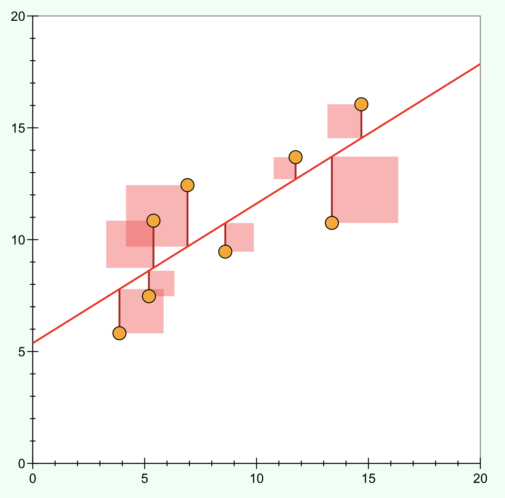

```{r setup, include=FALSE}
knitr::opts_chunk$set(echo = FALSE)
```

```{r echo=FALSE, eval=TRUE,message=FALSE, warning=FALSE}
library(tidyverse)
library(openintro)
library(gridExtra)
library(latex2exp)
library(kableExtra)
library(broom)
data(COL)
```

## Objectives

:::: {.column width=15%}
::::

:::: {.column width=70%}
- **Introduce the method of ordinary least squares**
- **Develop an understanding of assessing residuals of a linear model**
- **Know how to compute the best fit line**
- **Activity: Assessing Residuals of a Linear Model**
::::

:::: {.column width=15%}
::::

## Previously... 

**The Linear Model**

A **linear model** is written as 

\[ y = \beta_0 + \beta_1 x + \epsilon  \]

where $y$ is the outcome, $x$ is the predictor, $\beta_0$ is the intercept, and $\beta_1$ is the slope. The notation $\epsilon$ is the model's error.

*Notation:*

* Population Parameters: $\beta_0$ and $\beta_1$
* Sample statistics (point estimates for the parameters): $b_0$ and $b_1$
* Estimated/Predicted outcome: $\hat{y} = b_0 + b_1 x$
  
We can use the **sample statistics $b_0$ and $b_1$** as point estimates to infer the true value of the **population parameters $\beta_0$ and $\beta_1$**.

## Examples of Best Fit Linear Models on Data

```{r sampleLinesAndResPlots, fig.align='center', fig.cap="Sample data with their best fitting lines (top row) and their corresponding residual plots (bottom row).", message=FALSE, warning=FALSE, out.width='75%'}
neg_lin <- simulated_scatter %>% filter(group == 6)
neg_cur <- simulated_scatter %>% filter(group == 7)
random  <- simulated_scatter %>% filter(group == 8)

neg_lin_mod <- augment(lm(y ~ x, data = neg_lin))
neg_cur_mod <- augment(lm(y ~ x, data = neg_cur))
random_mod  <- augment(lm(y ~ x, data = random))

p_neg_lin <- ggplot(neg_lin, aes(x = x, y = y)) +
  geom_point(size = 2, alpha = 0.8) +
  geom_smooth(method = "lm", se = FALSE) +
  theme_void() +
  theme(panel.border = element_rect(colour = "gray", fill = NA, size = 1))

p_neg_cur <- ggplot(neg_cur, aes(x = x, y = y)) +
  geom_point(size = 2, alpha = 0.8) +
  geom_smooth(method = "lm", se = FALSE) +
  theme_void() +
  theme(panel.border = element_rect(colour = "gray", fill = NA, size = 1))

p_random <- ggplot(random, aes(x = x, y = y)) +
  geom_point(size = 2, alpha = 0.8) +
  geom_smooth(method = "lm", se = FALSE) +
  theme_void() +
  theme(panel.border = element_rect(colour = "gray", fill = NA, size = 1))

p_neg_lin_res <- ggplot(neg_lin_mod, aes(x = .fitted, y = .resid)) +
  geom_point(size = 2, alpha = 0.8) +
  geom_hline(yintercept = 0, linetype = "dashed") +
  theme_void() +
  theme(panel.border = element_rect(colour = "gray", fill = NA, size = 1))

p_neg_cur_res <- ggplot(neg_cur_mod, aes(x = .fitted, y = .resid)) +
  geom_point(size = 2, alpha = 0.8) +
  geom_hline(yintercept = 0, linetype = "dashed") +
  theme_void() +
  theme(panel.border = element_rect(colour = "gray", fill = NA, size = 1))

p_random_res <- ggplot(random_mod, aes(x = .fitted, y = .resid)) +
  geom_point(size = 2, alpha = 0.8) +
  geom_hline(yintercept = 0, linetype = "dashed") +
  theme_void() +
  theme(panel.border = element_rect(colour = "gray", fill = NA, size = 1))

grid.arrange(p_neg_lin,p_neg_cur,p_random,p_neg_lin_res,p_neg_cur_res,p_random_res,nrow=2)
```

## Idealized Examples of Residual Scatter Plots

```{r residu-plots-examples, echo=FALSE, fig.cap="Image Source: [Model Validation: Interpreting Residual Plots Daniel Hocking in R bloggers](https://www.r-bloggers.com/2011/07/model-validation-interpreting-residual-plots/){target=_blank}", out.width="45%", fig.align="center"}
knitr::include_graphics("resid-plots-r-blogger.gif")
```

Terms:

* **Homoscedastic** residuals $\longrightarrow$ constant variance.
* **Heteroscedastic** residuals $\longrightarrow$ non-constant variance.

## Ordinary Least Squares Assumptions

* The data is randomly sampled independent observations.
* The distribution of the residuals is normally distributed and the residuals exhibits homoscedasticity.
* The independent variables are uncorrelated with the error term.
* The regression model is linear in the coefficients and the error term.
* The independent variables should not be collinear - or correlated to each other.

## Sum of Squared Error (SSE) and the Total Sum of Squares (TSS)

The **Sum of Squared Error (SSE)** is a metric of left-over variability in the $y$ values if we know $x$.

$$
SSE = (\epsilon_1)^2 + (\epsilon_2)^2 + \cdots (\epsilon_n)^2
$$

The **Total Sum of Squares (SST)** is a metric measure the variability in the $y$ values by how far they tend to fall from their mean, $\bar{y}$.

$$
SST = (y_1 - \bar{y})^2 + (y_2 - \bar{y})^2 + \cdots + (y_n - \bar{y})^2
$$

where $\bar{y} = \frac{1}{n} \left(y_1 + y_2 + \cdots + y_n \right)$, and $n$ is the number of observations.

## Minimizing the SSE

To find the best linear fit, we minimize the SSE.

$$
\begin{aligned}
SSE & = (\epsilon_1)^2 + (\epsilon_2)^2 + \cdots (\epsilon_n)^2 \\ 
    & = (y_1 - \hat{y_1})^2 + (y_2 - \hat{y_2})^2 + \cdots + (y_n - \hat{y_n})^2
\end{aligned}
$$

Plugging-in the linear equation $\hat{y} = b_0 + b_1 x$, we have

$$
SSE = (y_1 - (b_0 + b_1 x_1)^2 + (y_2 - (b_0 + b_1 x_2)^2 + \cdots + (y_n - (b_0 + b_1 x_n)^2.
$$

Minimizing the above equation over all possible values of $b_0$ and $b_1$ is a calculus problem. Take the derivative of SSE with respect to $b_1$, set it equal to zero, and solve for $b_1$.

Long story short,

$$
\begin{aligned}
b_1 = & \frac{s_y}{s_x} r \\
b_0 = & \bar{y} - b_1 \bar{x}
\end{aligned}
$$

where:

* $s_y$ and $s_x$ are the standard deviations of $x$ and $y$ respectively
* $r$ is the pearson correlation coefficient of $x$ and $y$.
* $\bar{x}$ and $\bar{y}$ are the mean of $x$ and $y$ respectively.

## Least-Squares Example Visualization

```{r least-squares-diagram, echo=FALSE, fig.cap="Least-Squares Example Visualization: Shown here is some data (orange dots) and the best fit linear model (red line). You can try this [least-squares regression interactive demo](https://phet.colorado.edu/sims/html/least-squares-regression/latest/least-squares-regression_en.html){target=_blank} to visualize on how it works.", out.width="45%", fig.align="center"}

```

## Finding the Best Fit

To find the best fit linear model to data, we compute the slope and intercept by using the correlation and standard deviations.

$$
\begin{aligned}
\text{mean of x} \longrightarrow & \bar{x} = \frac{1}{n} \left( x_1 + x_2 + \cdots + x_n \right) \\
\text{mean of y} \longrightarrow & \bar{y} = \frac{1}{n} \left( y_1 + y_2 + \cdots + y_n \right) \\
\text{standard deviation of x} \longrightarrow & s_x = \sqrt{\frac{1}{n-1} \left( \left(x_1 - \bar{x}\right)^2 + \left(x_2 - \bar{x}\right)^2 + \cdots + \left(x_n - \bar{x}\right)^2 \right)} \\
\text{standard deviation of y} \longrightarrow & s_y = \sqrt{\frac{1}{n-1} \left( \left(y_1 - \bar{y}\right)^2 + \left(y_2 - \bar{y}\right)^2 + \cdots + \left(y_n - \bar{y}\right)^2 \right)} \\
\text{correlation of x and y} \longrightarrow & r = \frac{\left( \left(x_1 - \bar{x} \right)\left(y_1 - \bar{y} \right) + \left(x_2 - \bar{x} \right)\left(y_2 - \bar{y}\right) + \cdots + \left(x_n - \bar{x} \right)\left(y_n - \bar{y}\right) \right)}{\sqrt{\left( \left(x_1 - \bar{x}\right)^2 + \left(x_2 - \bar{x}\right)^2 + \cdots + \left(x_n - \bar{x}\right)^2 \right) \left( \left(y_1 - \bar{y}\right)^2 + \left(y_2 - \bar{y}\right)^2 + \cdots + \left(y_n - \bar{y}\right)^2 \right) }} \\
\text{best fit slope} \longrightarrow & b_1 = \frac{s_y}{s_x} r \\
\text{best fit intercept} \longrightarrow & b_0 = \bar{y} - b_1 \bar{x}
\end{aligned}
$$

We typically use software --such as R-- to compute the above values.

## Interpreting the Slope Estimate

* Using least-squares regression is typically the most helpful when dealing with data.
* The slope in terms of the standard deviations and correlation helps us interpret it more precisely.
* The math helps us understand more thoroughly of how linear regression works.
* The ratio $\frac{s_y}{s_x}$ in the least squares slope $b_1$ tells us the average change in the predicted values of the response variable when the explanatory variable increases by 1 unit.
  
$$
b_1 = \frac{s_y}{s_x} r
$$

## Measuring the Strength of the Linear Fit

The **coefficient of determination** can then be calculated as

$$
R^2 = \frac{SST - SSE}{SST} = 1 - \frac{SSE}{SST}
$$

where

$$
SSE = (\epsilon_1)^2 + (\epsilon_2)^2 + \cdots  (\epsilon_n)^2 \hspace{10px} \text{ and } \hspace{10px} SST = (y_1 - \bar{y})^2 + (y_2 - \bar{y})^2 + \cdots + (y_n - \bar{y})^2.
$$

The range of $R^2$ is from 0 to 1. $R^2$ is the a measure of how well the linear regression fits the data.

Interpretation:

* Value of 0 means 0% of the variance in the data is captured by the model. (bad and not a "good" fit)
* Value of 1 means 100% of the variance in the data is captured by the model. (over-fitting and impacts the ability for the model to generalize about the population)
* Ideally, you want an $R^2$ value close to 1.
  
In the case for a linear model with one predictor and one outcome, the relationship between the correlation and the coefficient of determination is $R^2 = r^2$.
  
## Outliers in Linear Regression

<div class='left' style='float:left;width:48%'>
```{r outlier-plots-1, fig.cap = "Three plots, each with a least squares line and corresponding residual plot. Each dataset has at least one outlier.", out.width = "100%", fig.width = 8, fig.asp = 0.6, fig.align='center', message=FALSE,warning=FALSE}
d1 <- simulated_scatter %>% 
  filter(group == 24) %>%
  mutate(outlier = if_else(y == min(y), TRUE, FALSE))
d2 <- simulated_scatter %>% 
  filter(group == 25) %>%
  mutate(outlier = if_else(y == min(y), TRUE, FALSE))
d3 <- simulated_scatter %>% 
  filter(group == 26) %>%
  mutate(outlier = if_else(y == max(y), TRUE, FALSE))

m1_aug <- augment(lm(y ~ x, data = d1)) %>%
  mutate(outlier = if_else(y == min(y), TRUE, FALSE))

m2_aug <- augment(lm(y ~ x, data = d2)) %>%
  mutate(outlier = if_else(y == min(y), TRUE, FALSE))

m3_aug <- augment(lm(y ~ x, data = d3)) %>%
  mutate(outlier = if_else(y == max(y), TRUE, FALSE))

p_1 <- ggplot(d1, aes(x = x, y = y)) +
  geom_point(size = 2, alpha = 0.8) +
  geom_smooth(method = "lm", se = FALSE) +
  geom_point(data = d1 %>% filter(outlier), 
             size = 5, shape = "circle open", 
             color = IMSCOL["red", "full"], stroke = 2) +
  labs(title = "A") +
  theme(
    panel.grid = element_blank(),
    axis.text = element_blank(),
    panel.border = element_rect(colour = "gray", fill = NA, size = 1)
    ) +
  scale_x_continuous(expand = expansion(mult = 0.12)) +
  scale_y_continuous(expand = expansion(mult = 0.12))


p_1_res <- ggplot(m1_aug, aes(x = .fitted, y = .resid)) +
  geom_point(alpha = 0.7, size = 2) +
  geom_hline(yintercept = 0, linetype = "dashed") +
  geom_point(data = m1_aug %>% filter(outlier), 
             size = 5, shape = "circle open", 
             color = IMSCOL["red", "full"], stroke = 2) +
  labs(x = "Predicted y", y = "Residual") +
  theme(
    panel.grid = element_blank(),
    axis.text = element_blank(),
    panel.border = element_rect(colour = "gray", fill = NA, size = 1)
    ) +
  scale_x_continuous(expand = expansion(mult = 0.12)) +
  scale_y_continuous(limits = c(-8, 8), expand = expansion(mult = 0.12))

p_2 <- ggplot(d2, aes(x = x, y = y)) +
  geom_point(size = 2, alpha = 0.8) +
  geom_smooth(method = "lm", se = FALSE) +
  geom_point(data = d2 %>% filter(outlier), 
             size = 5, shape = "circle open", 
             color = IMSCOL["green", "full"], stroke = 2) + 
  labs(title = "B") +
  theme(
    panel.grid = element_blank(),
    axis.text = element_blank(),
    panel.border = element_rect(colour = "gray", fill = NA, size = 1)
    ) +
  scale_x_continuous(expand = expansion(mult = 0.12)) +
  scale_y_continuous(expand = expansion(mult = 0.12))

p_2_res <- ggplot(m2_aug, aes(x = .fitted, y = .resid)) +
  geom_point(size = 2, alpha = 0.8) +
  geom_hline(yintercept = 0, linetype = "dashed") +
  geom_point(data = m2_aug %>% filter(outlier), 
             size = 5, shape = "circle open", 
             color = IMSCOL["green", "full"], stroke = 2) +
  labs(x = "Predicted y", y = "Residual") +
  theme(
    panel.grid = element_blank(),
    axis.text = element_blank(),
    panel.border = element_rect(colour = "gray", fill = NA, size = 1)
    ) +
  scale_x_continuous(expand = expansion(mult = 0.12)) +
  scale_y_continuous(limits = c(-8, 8), expand = expansion(mult = 0.12))

p_3 <- ggplot(d3, aes(x = x, y = y)) +
  geom_point(size = 2, alpha = 0.8) +
  geom_smooth(method = "lm", se = FALSE) +
  geom_point(data = d3 %>% filter(outlier), 
             size = 5, shape = "circle open", 
             color = IMSCOL["pink", "full"], stroke = 2) +
  labs(title = "C") +
  theme(
    panel.grid = element_blank(),
    axis.text = element_blank(),
    panel.border = element_rect(colour = "gray", fill = NA, size = 1)
    ) +
  scale_x_continuous(expand = expansion(mult = 0.12)) +
  scale_y_continuous(expand = expansion(mult = 0.12))

p_3_res <- ggplot(m3_aug, aes(x = .fitted, y = .resid)) +
  geom_point(size = 2, alpha = 0.8) +
  geom_hline(yintercept = 0, linetype = "dashed") +
  geom_point(data = m3_aug %>% filter(outlier), 
             size = 5, shape = "circle open", 
             color = IMSCOL["pink", "full"], stroke = 2) +
  labs(x = "Predicted y", y = "Residual") +
  theme(
    panel.grid = element_blank(),
    axis.text = element_blank(),
    panel.border = element_rect(colour = "gray", fill = NA, size = 1)
    ) +
  scale_x_continuous(expand = expansion(mult = 0.12)) +
  scale_y_continuous(limits = c(-8, 8), expand = expansion(mult = 0.12))

grid.arrange(p_1,p_2,p_3,p_1_res,p_2_res,p_3_res,nrow=2)
```
</div>

<div class='right' style='float:right;width:48%'>
* A: There is one outlier far from the other points, though it only appears to slightly influence the line.
* B: There is one outlier on the right, though it is quite close to the least squares line, which suggests it wasn't very influential.
* C: There is one point far away from the cloud, and this outlier appears to pull the least squares line up on the right; examine how the line around the primary cloud doesn't appear to fit very well.
* Note that the residual plots here are the predicted y vs residuals instead of the explanatory variables vs residuals. These are two different ways to look at residuals for evaluating a linear model.
</div>

## Outliers in Linear Regression

**Types of outliers.**
  
* A point (or a group of points) that stands out from the rest of the data is called an **outlier**.
* Outliers that fall horizontally away from the center of the cloud of points are called **leverage points**.
* Outliers that influence on the slope of the line are called **influential points**.
  
We must be cautious on removing outliers in our modeling. Sometimes outliers are interesting cases that might be worth investigating and it might even make a model much better.
  
Try out this [least-squares regression interactive demo](https://phet.colorado.edu/sims/html/least-squares-regression/latest/least-squares-regression_en.html){target=_blank} to play around with outliers in least squares regression.

## Activity: Assessing Residuals of a Linear Model

1. Make sure you have a copy of the *F 4/11 Worksheet*. This will be handed out physically. This worksheet will be available on Moodle after class.
2. Work on your worksheet by yourself for 10 minutes. Please read the instructions carefully. Ask questions if anything need clarifications.
3. Get together with another student.
4. Discuss your results.
5. Submit your worksheet on Moodle as a `.pdf` file.

## References

::: {#refs}
:::
