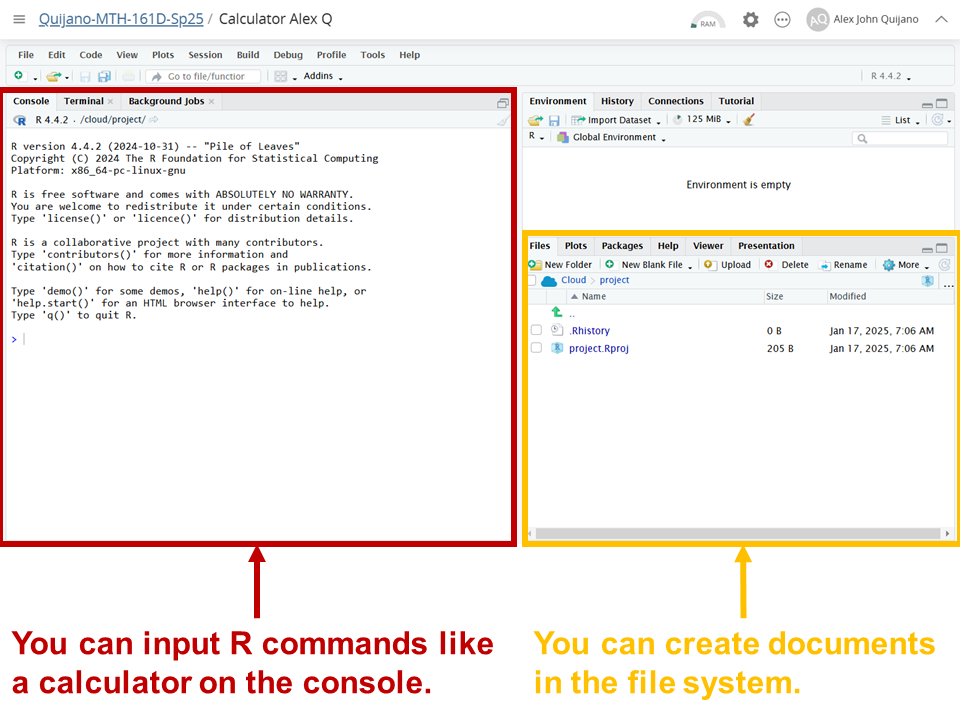
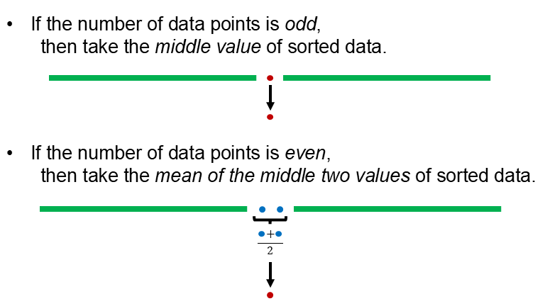

```{r setup, include=FALSE}
knitr::opts_chunk$set(echo = TRUE)
```

## Objectives

:::: {.column width=15%}
::::

:::: {.column width=70%}
- **Explain types of variables**
- **Develop an understanding of the different types of variables**
- **Know how to compute the mean, median, frequency, and proportion**
- **Activity: Identify types of variables & compute descriptive statistics**
::::

:::: {.column width=15%}
::::

## Previously... (1/2)

The guiding principle of elementary statistics is statistical thinking.

```{r statistical-thinking-1, echo=FALSE, fig.cap="Statistical Thinking in the Data Science Life Cycle", fig.align='center', out.width = '55%'}
knitr::include_graphics("statistical-thinking-in-data-science-lifecycle.png")
```

## Previously... (2/2)

```{r rstudio-1, echo=FALSE, fig.cap="Basic Parts of R Studio", fig.align='center', out.width = '50%'}

```

## Types of Variables

```{r types-of-variables, echo=FALSE, fig.cap="Types of Variables [@diez2012openintro]", fig.align='center', out.width = '70%'}
knitr::include_graphics("variables.png")
```

## Numerical: Discrete vs Continuous

**Numerical variables** are quantitative variables that represent measurable amounts or quantities.

:::: {.column width=49%}
**Discrete**

* Take distinct, separate values (often whole numbers).
* Typically countable.
* Examples:
    - Number of students in a class (e.g. 25 students)
    - Books sold per day (e.g. 10 books/day)
::::

:::: {.column width=49%}
**Continuous**

* Can take any value within a range, including fractions and decimals.
* Measured rather than counted.
* Examples:
    - Height of a person (e.g., 5.7 ft).
    - Time taken to complete a task (e.g., 3.25 hours).
::::

## Categorical: Nominal vs Ordinal

**Categorical variables** are qualitative variables that represent labels or categories. They describe characteristics and are not inherently numerical.

:::: {.column width=49%}
**Nominal**

* Categories have no natural order or ranking.
* Used for labeling without quantitative significance.
* Examples:
    - Colors of cars (e.g., red, blue, green).
    - Types of animals (e.g., cat, dog, bird).
::::

:::: {.column width=49%}
**Ordinal**

* Categories have a meaningful order or ranking, but the intervals between ranks are not consistent.
* Examples:
    - Education level (e.g., high school, bachelor’s, master’s).
    - Customer satisfaction (e.g., satisfied, neutral, dissatisfied).
::::

## Case Study 1

> An experiment is evaluating the effectiveness of a new drug in treating migraines. A group variable is used to indicate the experiment group for each patient: treatment or control. The number of migraines variable represents the number of migraines the patient experienced during a 3-month period. Classify each variable as either numerical or categorical.
  
**Variables:**

  - The **group** variable is with categories **treatment** and **control**. So, group is a **nominal categorical variable** because the categories are with no discernible order.
  - The variable with **number of migraines** is a **discrete numerical variable** because the values are countable whole numbers.

## Descriptive Statistics

**Descriptive statistics** involves organizing, summarizing, and presenting data in an informative way. It Focuses on describing and understanding the main features of a dataset.

:::: {.column width=49%}
**For Numerical Variables**

* Measures of Central Tendency
    - **<span style="color:red;">Mean (Average)</span>**, **<span style="color:red;">Median</span>**, and Mode
* Measures of Dispersion (Spread)
    - Range, Variance, Standard Deviation, Interquartile Range (IQR)
::::

:::: {.column width=49%}
**For Categorical Variables**

* **<span style="color:red;">Frequency</span>**
* **<span style="color:red;">Relative Frequency (Proportion)</span>**
* Percentage
* Cumulative Frequency
::::

## Computing the Mean (Average) (1/2)

The **<span style="color:red;">Mean (Average)</span>** is the *sum* of all data points divided by the *number of points*.

The mean is computed using the formula $$\text{mean} = \frac{\text{sum of all data points}}{\text{number of data points}}.$$

## Computing the Mean (Average) (2/2)

**Example:** What is the mean of the data set $7,1,2,4,6,3,2,7$?

:::: {.column width=60%}
* *Manual Computation:*
\[
\begin{aligned}
 \text{mean} & = \frac{7+1+2+4+6+3+2+7}{8} \\
             & = 4
\end{aligned}
\]
::::

:::: {.column width=39%}
* *Using R:*
```{r mean-example}
num_data <- c(7,1,2,4,6,3,2,7)
mean(num_data)
```
::::

So, the mean is $4$.

## Computing the Median (1/2)

The **<span style="color:red;">Median</span>** is the *middle value* when the data is *sorted*.

The median is computed using the following cases:

```{r median-illustration, echo=FALSE, fig.cap="", fig.align='center', out.width = '60%'}

```

## Computing the Median (2/2)

**Example:** What is the median of the data set $7,1,2,4,6,3,2,7$?

:::: {.column width=60%}
* *Manual Computation:*

The number of data points is $8$, an even number.
$$\text{sorted data} \longrightarrow 1,2,2,\color{blue}{\mathbf{3}},\color{blue}{\mathbf{4}},6,7,7$$

\[
\begin{aligned}
 \text{median} & = \frac{\text{sum of two middle values}}{2} \\
             & = \frac{\color{blue}{\mathbf{3}}+\color{blue}{\mathbf{4}}}{2} \\
             & = 3.5
\end{aligned}
\]
::::

:::: {.column width=39%}
* *Using R:*
```{r median-example-1}
num_data <- c(7,1,2,4,6,3,2,7)
sort(num_data)
median(num_data)
```
::::

So, the median is $3.5$.

## Computing the Frequency (1/2)

The **<span style="color:red;">Frequency</span>** is the number of observations in each category.

The method of computing the frequencies of a categorical variable is as follows:

:::: {.column width=15%}
::::

:::: {.column width=70%}
* List all unique categories in the data
* Count the number of observations of each category
* List the counts with their corresponding unique categories
::::

:::: {.column width=15%}
::::

## Computing the Frequency (2/2)

**Example:** How many *b* and *g* are there in the data listed below?

$$b, g, g, b, b, g, b, b$$

:::: {.column width=39%}
* *Manual Computation:*

The unique categories are *b* and *g*.

Number of occurrences: 
\[
\begin{aligned}
b,b,b,b,b & \longrightarrow 5 \\
g,g,g & \longrightarrow 3
\end{aligned}
\]
::::

:::: {.column width=60%}
* *Using R:*

```{r}
cat_data <- c("b","g","g","b","b","g","b","b")
table(cat_data)
```
::::

So, there are $5$ *b* and $3$ *g*.

## Computing the Relative Frequency (1/2)

The **<span style="color:red;">Relative Frequency</span>** is the proportion of observations in each category.

The proportion is the computed using the formula

$$\text{proportion of a category} = \frac{\text{number of cases of a category}}{\text{total number of cases}}.$$

## Computing the Relative Frequency (2/2)

**Example:** What are the proportions of *b* and *g* in the data listed below?

$$b, g, g, b, b, g, b, b$$

:::: {.column width=39%}
* *Manual Computation:*

The unique categories are *b* and *g*.

Number of occurrences: 
\[
\begin{aligned}
b,b,b,b,b & \longrightarrow 5 \\
g,g,g & \longrightarrow 3
\end{aligned}
\]

Number of cases: $8$

Proportions:
\[
\begin{aligned}
b & \longrightarrow \frac{5}{8} = 0.625 \\
g & \longrightarrow \frac{3}{8} = 0.375
\end{aligned}
\]
::::

:::: {.column width=60%}
* *Using R:*

```{r}
cat_data <- c("b","g","g","b","b","g","b","b")
table(cat_data)/length(cat_data)
```
::::

So, there are $0.625$ *b* and $0.375$ *g*.

## Activity: Identify types of variables & compute descriptive statistics

1. Make sure you have a copy of the *F 1/24 Worksheet*. This will be handed out physically and it is also digitally available on Moodle. Then, access your *Calculator [First name] [First letter of last name]* in Posit Cloud.

2. Work on your worksheet by yourself for 10 minutes.

3. Get together with another student.

4. Discuss your results.

5. Submit your worksheet on Moodle as a `.pdf` file.

## References

::: {#refs}
:::