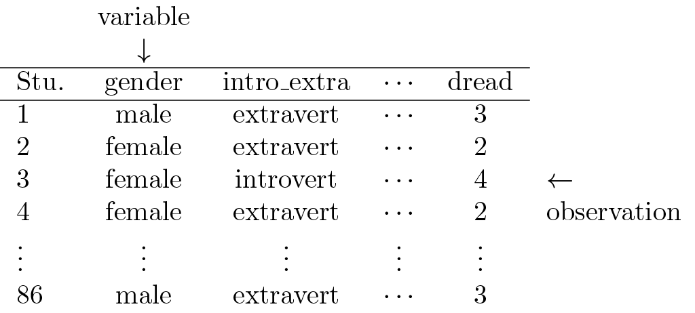

```{r setup, include=FALSE}
knitr::opts_chunk$set(echo = TRUE)
```

## Objectives

:::: {.column width=15%}
::::

:::: {.column width=70%}
- **Know how data is organized into data tables**
- **Develop the ability to understand and identify relationships between variables**
- **Activity: Identify Variable Relationships**
::::

:::: {.column width=15%}
::::

## Previously... 

```{r types-of-variables, echo=FALSE, fig.cap="Types of Variables [@diez2012openintro]", fig.align='center', out.width = '70%'}
knitr::include_graphics("variables.png")
```

## Case Study 1

A survey was conducted on students in an introductory statistics course. Below are a few of the questions on the survey, and the corresponding variables the data from the responses were stored in:

:::: {.column width=15%}
::::

:::: {.column width=70%}
* **gender:** What is your gender?
* **intro_extra:** Are you an introvert or an extrovert?
* **sleep:** How many hours do you sleep at night, on average?
* **bedtime:** What time do you usually go to bed?
* **countries:** How many countries have you visited?
* **dread:** On a scale of 1-5, how much do you dread being here?
::::

:::: {.column width=15%}
::::

## Case Study 1: Data Matrix

Data collected on students in a statistics class on a variety of variables:

```{r data-matrix-with-labels, echo=FALSE, fig.cap="Example Data Matrix", fig.align='center', out.width = '70%'}

```

## Case Study 1: Identify Types of Variables

:::: {.column width=50%}
```{r data-matrix, echo=FALSE, fig.cap="", fig.align='center', out.width = '100%'}
knitr::include_graphics("data-matrix.png")
```
::::

:::: {.column width=49%}
* **gender:** nominal categorical
* **sleep:** continuous numerical
* **bedtime:** ordinal categorical
* **countries:**  discrete numerical
* **dread:** ordinal categorical - could also be used as numerical
::::

## Relationship Among Variables

**Does there appear to be a relationship between the hours of study per week and the GPA of a student?**

```{r gpa-vs-study-hours, echo=FALSE, fig.align='center', fig.cap="", message=FALSE, warning=FALSE, out.width='60%'}
library(openintro)
plot(gpa_study_hours$gpa ~ gpa_study_hours$study_hours, pch = 19, col = COL[1,3], xlab = "Hours of study / week", ylab = "GPA", cex.lab = 1.5, cex.axis = 1.5)
```

::: {style="color: red;"}
$\star$ As hours of study increases, the GPA also increases but for study hours around 0 to 30 hours, there is a lot of variation. There is one student with GPA > 4.0, this is likely a data error.
:::

## Explanatory vs Response Variables

* To identify the explanatory variable in a pair of variables, identify which of the two is suspected of affecting the other:

$$\text{explanatory variable} \xrightarrow{\text{might affect}} \text{response variable}$$

* Labeling variables as explanatory and response does not guarantee the relationship between the two is actually causal, even if there is an association identified between the two variables. We use these labels only to keep track of which variable we suspect affects the other.

## Associated vs Independent Variables

:::: {.column width=15%}
::::

:::: {.column width=70%}
* When two variables show some connection with one another, they are called <span style="color:blue">**associated**</span> variables.

* Associated variables can also be called <span style="color:blue">**dependent**</span> variables and vice-versa.

* If two variables are not associated, i.e. there is no evident connection between the two, then they are said to be <span style="color:blue">**independent**</span>.

* In general, <span style="color:blue">**association does not imply causation**</span>, and causation can only be inferred from a randomized experiment.
::::

:::: {.column width=15%}
::::

## Activity: Identify Variable Relationships

1. Make sure you have a copy of the *M 1/27 Worksheet*. This will be handed out physically and it is also digitally available on Moodle.
2. Work on your worksheet by yourself for 10 minutes. Please read the instructions carefully. Ask questions if anything need clarifications.
3. Get together with another student.
4. Discuss your results.
5. Submit your worksheet on Moodle as a `.pdf` file.

## References

::: {#refs}
:::
