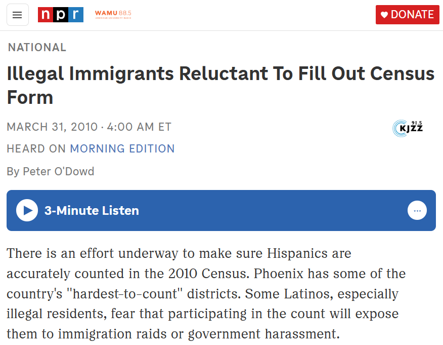
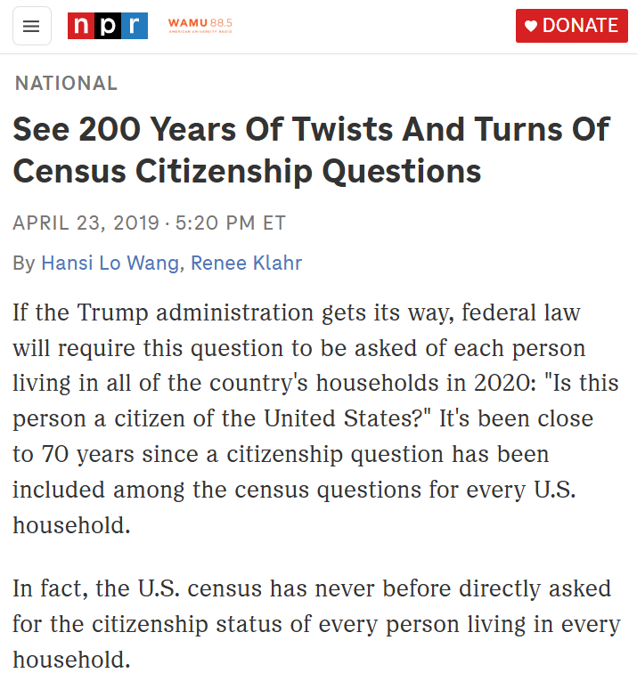
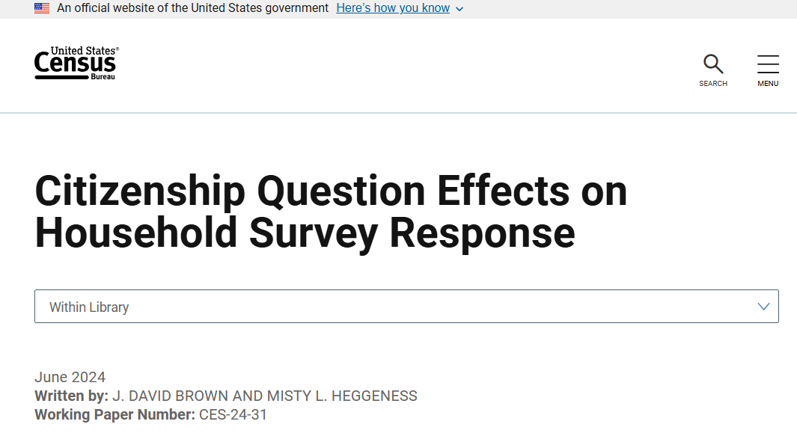
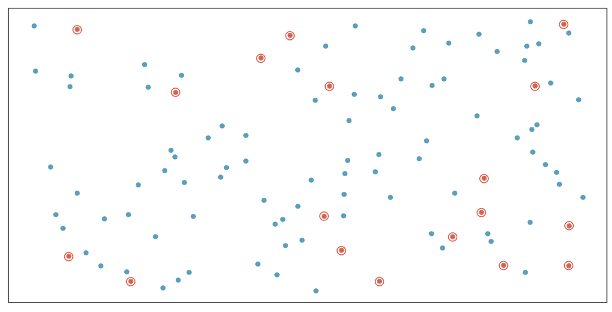
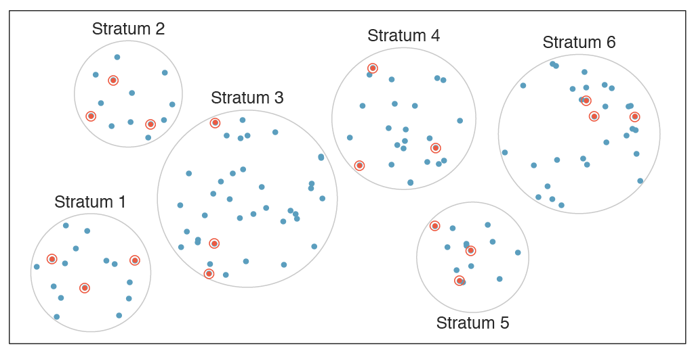
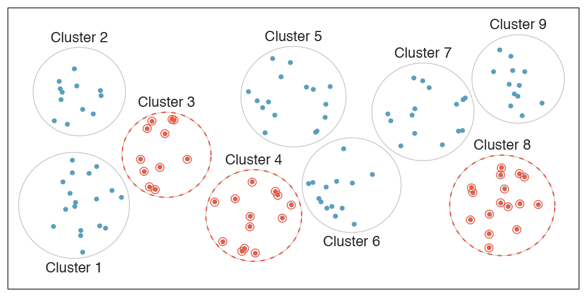
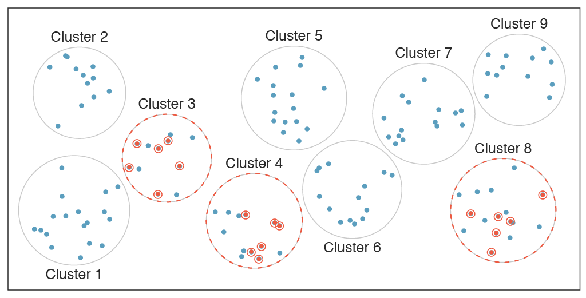

```{r setup, include=FALSE}
knitr::opts_chunk$set(echo = TRUE)
```

## Objectives

:::: {.column width=15%}
::::

:::: {.column width=70%}
- **Know how to identify types of sampling method**
- **Develop an understanding of sampling bias and anecdotal evidence**
- **Introduce the meaning of statistical inference**
- **Activity: Identify the Sampling Method**
::::

:::: {.column width=15%}
::::

*These slides are derived from @diez2012openintro.*

## Previously... (1/2)

```{r types-of-variables, echo=FALSE, fig.cap="Types of Variables", fig.align='center', out.width = '70%'}
knitr::include_graphics("variables.png")
```

## Previously... (2/2)

The guiding principle of statistics is statistical thinking.

```{r statistical-thinking-1, echo=FALSE, fig.cap="Statistical Thinking in the Data Science Life Cycle", fig.align='center', out.width = '55%'}
knitr::include_graphics("statistical-thinking-in-data-science-lifecycle.png")
```

## Case Study I: Population vs Sample

**Research Question:** Can people become better, more efficient runners on their own, merely by running?

:::: {.column width=15%}
::::

:::: {.column width=70%}
* **Population of Interest:** All people
* **Sample:** Group of adult women who recently joined a running group
* **Population to which results can be generalized:** Adult women, if the data are randomly sampled.
::::

:::: {.column width=15%}
::::

::: {style="color: red;"}
$\star$ The random sample taken can only be generalized for adult women, not all people.
:::

## Case Study II: Anecdotal Evidence

**Research Question:** Can smoking contribute to negative health outcomes?

:::: {.column width=15%}
::::

:::: {.column width=70%}
* **Population of Interest:** All people
* **Sample:** A random person on the internet that said "My uncle smokes three packs a day and he's in perfectly good health".
* **"Conclusion":** You may be compelled that smoking is fine.
::::

:::: {.column width=15%}
::::

::: {style="color: red;"}
$\star$ **Anecdotal evidence** refers to information or conclusions drawn from personal experiences, individual stories, or isolated examples rather than systematic data collection or rigorous scientific analysis.
:::

## Case Study II: Early Smoking Research

**Research Question:** Can smoking contribute to negative health outcomes?

:::: {.column width=15%}
::::

:::: {.column width=70%}
* Early anti-smoking research in the 1930s-40s faced resistance due to anecdotal evidence from individual cases.
* Smoking studies were challenging due to human variability and the complexity of behavior.
* Larger studies eventually revealed clear trends linking smoking to negative health effects.
::::

:::: {.column width=15%}
::::

::: {style="color: red;"}
$\star$ **Overgeneralization** is a logical fallacy where a conclusion is drawn from insufficient or unrepresentative evidence, applying it too broadly.
:::

## Census

**Wouldn't it be better to just include everyone and "sample" the entire population?**

:::: {.column width=49%}
This is called a **Census**.

* A census is a systematic count of a population. 
* It collects detailed information about individuals and households. 
* Censuses are usually carried out at regular intervals and are used for policy-making, resource allocation, and demographic analysis.
* The purpose of the census is to have fair political representation, helping researchers and businesses to make people's lives better.
::::

:::: {.column width=50%}
**Problems with taking a census:**

* Some people are hard to find or measure, often due to unique characteristics.
* Populations also change constantly, making a perfect count impossible.
* In some cases, a full census can be more complicated than sampling.
* **Sampling bias** introduces a lot of problems and consequences.
::::

## Sampling Bias

**What is sampling bias?** It occurs when the sample collected for a study or survey is not representative of the larger population that the study aims to analyze.

There are several ways sampling bias can occur, such as:

:::: {.column width=10%}
::::

:::: {.column width=80%}
* **Non-random sampling:** If the method used to select the sample is not random or systematic, certain groups might have a higher chance of being included.
* **Self-selection bias (voluntary response):** When individuals choose themselves to participate (e.g., in online surveys), the sample may include only those with specific characteristics or strong opinions.
* **Convenience sample (exclusion bias):** This happens when some segments of the population are systematically excluded from the sampling process, even unintentionally. Individuals who are easily accessible are more likely to be included in the sample.
::::

:::: {.column width=10%}
::::

## Case Study III: Sampling Bias (1/2)

:::: {.column width=54%}
```{r npr-2020-census-illegal-immigration, echo=FALSE, fig.cap="", fig.align='center', out.width = '100%'}

```

[NPR: Illegal Immigrants Reluctant to Fill Out Census Form](https://www.npr.org/2010/03/31/125380052/illegal-immigrants-reluctant-to-fill-out-census-form){target="_blank"}
::::

:::: {.column width=45%}
```{r npr-200-years-of-citizenship-question, echo=FALSE, fig.cap="", fig.align='center', out.width = '100%'}

```

[NPR: See 200 Years Of Twists And Turns Of Census Citizenship Questions](https://www.npr.org/2019/04/23/630562915/see-200-years-of-twists-and-turns-of-census-citizenship-questions){target="_blank"}
::::

## Case Study III: Sampling Bias (2/2)

:::: {.column width=45%}
```{r us-census-citizenship-question-effects, echo=FALSE, fig.cap="", fig.align='center', out.width = '100%'}

```

[US Census: Citizenship Question Effects on Household Survey Response](https://www.census.gov/library/working-papers/2024/adrm/CES-WP-24-31.html){target="_blank"}
::::

:::: {.column width=54%}
* **Impact on the Census:** 
    - Undocumented immigrants may avoid the census due to fear of deportation or mistrust of the government.
    - Controversies surrounding the inclusion of citizenship questions in recent censuses and their impact on data collection and representation.
* **Consequences:**
    - This lead to an undercount --for both documented and undocumented immigrants-- which leads to inaccurate demographic data.
::::

## Exploratory Analysis to Inference

**What is Exploratory Analysis?** It is the process of analyzing and summarizing datasets to uncover patterns, trends, relationships, and anomalies before inference.

:::: {.column width=15%}
::::

:::: {.column width=70%}
* Sampling is natural.
* Think about sampling something you are cooking - you taste (*examine*) a small part of what you're cooking to get an idea about the dish as a whole.
* When you taste a spoonful of soup and decide the spoonful you tasted isn't salty enough, that's **exploratory analysis**.
* If you generalize and conclude that your entire soup needs salt, that's an **inference**.
::::

:::: {.column width=15%}
::::

## Inference

**What is inference?** It is the process of drawing conclusions about a population based on sample data. This involves using data from a sample to make generalizations, predictions, or decisions about a larger group.

:::: {.column width=15%}
::::

:::: {.column width=70%}
* For your inference to be valid, the spoonful you tasted (the **sample**) needs to be **representative** of the entire pot (the **population**).
* If your spoonful comes only from the surface and the salt is collected at the bottom of the pot (**sampling bias**), what you tasted is probably not representative of the whole pot.
* If you first stir the soup thoroughly before you taste (**random sampling**), your spoonful will more likely be representative of the whole pot.
::::

:::: {.column width=15%}
::::

## Obtaining Good Samples

:::: {.column width=15%}
::::

:::: {.column width=70%}
* Almost all statistical methods are based on the notion of implied randomness.

* Most commonly used random sampling techniques are **simple**, **stratified**, and **cluster** sampling.
::::

:::: {.column width=15%}
::::

## Simple Random Sample

**What is simple random sampling?** Randomly select cases from the population, where there is no implied connection between the points that are selected.

```{r simple-diagram, echo=FALSE, fig.cap="", fig.align='center', out.width = '80%'}

```

## Stratified Sample

**What is stratified sampling?** **Strata**are made up of similar observations. We take a simple random sample from each stratum.

```{r stratified-diagram, echo=FALSE, fig.cap="", fig.align='center', out.width = '80%'}

```

## Cluster Sample

**What is cluster sampling?** **Clusters** are usually not made up of homogeneous observations. We take a simple random sample of clusters, and then sample all observations in that cluster.

```{r cluster-diagram, echo=FALSE, fig.cap="", fig.align='center', out.width = '80%'}

```

## Multistage Sample

**What is multistage sampling?** Clusters are usually not made up of homogeneous observations. We take a simple random sample of clusters, and then take a simple random sample of observations from the sampled clusters.

```{r multistage-diagram, echo=FALSE, fig.cap="", fig.align='center', out.width = '80%'}

```

## Case Study VI: Statified vs Clustered Sampling

**Scenario:** A hospital wants to survey nurse job satisfaction across departments.

| **Sampling Method** | **Process** | **Example** |
|:---|:---------|:------|
| *Stratified* | Divide nurses into departments (strata) and sample proportionally from each group. | 8 emergency, 6 ICU, 10 pediatrics, 16 general medicine |
| *Clustered* | Divide hospital into floors (clusters) and randomly select entire floors, surveying all nurses there. | Select 2 random floors and survey all nurses on those floors. |

**Key Difference:**

* *Stratified sampling* ensures proportional representation from all departments.
* *Clustered sampling* is more practical but may miss some groups.

## Activity: Identify the Sampling Method

1. Make sure you have a copy of the *W 1/29 Worksheet*. This will be handed out physically and it is also digitally available on Moodle.
2. Work on your worksheet by yourself for 10 minutes. Please read the instructions carefully. Ask questions if anything need clarifications.
3. Get together with another student.
4. Discuss your results.
5. Submit your worksheet on Moodle as a `.pdf` file.

## References

::: {#refs}
:::
