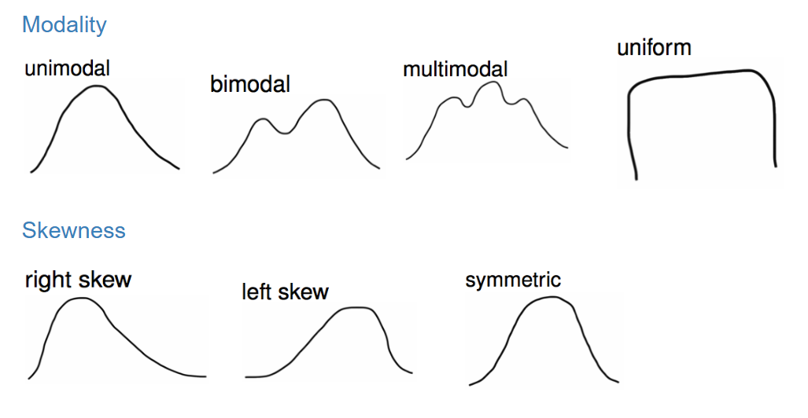

```{r setup, include=FALSE}
knitr::opts_chunk$set(echo = TRUE)
```

## Objectives

:::: {.column width=15%}
::::

:::: {.column width=70%}
- **Know how the mean is located on a distribution**
- **Understand how numerical data is examined **
- **Develop an understanding of various distribution shapes**
- **Activity: Identify the Shape of Distribution**
::::

:::: {.column width=15%}
::::

*These slides are derived from @diez2012openintro.*

## Previously... (1/3)

```{r types-of-variables, echo=FALSE, fig.cap="Types of Variables", fig.align='center', out.width = '70%'}
knitr::include_graphics("variables.png")
```

## Previously... (2/3)

**Exploratory Analysis**

It is the process of analyzing and summarizing datasets to uncover patterns, trends, relationships, and anomalies before inference.

**Descriptive statistics**

It involves organizing, summarizing, and presenting data in an informative way. It Focuses on describing and understanding the main features of a dataset.

:::: {.column width=49%}
**For Numerical Variables**

* Measures of Central Tendency
    - **<span style="color:blue;">Mean (Average)</span>**, **<span style="color:blue;">Median</span>**, and Mode
* Measures of Dispersion (Spread)
    - Range, Variance, Standard Deviation, Interquartile Range (IQR)
::::

:::: {.column width=49%}
**For Categorical Variables**

* **<span style="color:blue;">Frequency</span>**
* **<span style="color:blue;">Relative Frequency (Proportion)</span>**
* Percentage
* Cumulative Frequency
::::

## Previously... (3/3)

**Inference** 

It is the process of drawing conclusions about a population based on sample data. This involves using data from a sample to make generalizations, predictions, or decisions about a larger group.

:::: {.column width=10%}
::::

:::: {.column width=80%}
* **Population:** The entire group of individuals or items that a study aims to understand.
* **Sample:** A subset of the population selected for analysis to make inferences about the whole.
* **Sampling Bias:** A distortion in results caused by a non-representative sample.
* **Random Sampling:** A method of selecting a sample where each member of the population has an equal chance of being chosen.
::::

:::: {.column width=10%}
::::

## Scatterplots

:::: {.column width=50%}
**<span style="color:blue;">Scatterplots</span>** are useful for visualizing the relationship between *two numerical variables*.

* Do life expectancy and total fertility appear to be associated or independent?

    They appear to be linearly and negatively associated: as fertility increases, life expectancy decreases.
::::

:::: {.column width=49%}
```{r life_exp_child, echo=FALSE, eval=TRUE, fig.cap="", fig.align='center', out.width = '100%'}

```
http://www.gapminder.org/world
::::

## Dot Plots

**<span style="color:blue;">Dot plots</span>** are useful for visualizing one numerical variable. Darker colors represent areas where there are more observations.

```{r dot-plot-gpa, echo=FALSE, eval=TRUE,message=FALSE, warning=FALSE,  fig.align='center', out.width = '100%', fig.height=3}
library(openintro)
data(COL)
d = read.csv("gpa.csv")
gpa = d$gpa[d$gpa <= 4]
gpa = gpa[!is.na(gpa)]
openintro::dotPlot(gpa, pch = 19, col = COL[1,4], xlab = "GPA", xlim = c(2.5,4), ylab = "")
```

How would you describe the distribution of GPAs in this data set?

## Dot Plots and the Mean

```{r dot-plot-gpa-mean, echo=FALSE, eval=TRUE,message=FALSE, warning=FALSE,  fig.align='center', out.width = '100%', fig.height=3}
openintro::dotPlot(gpa, pch = 19, col = COL[1,4], xlab = "GPA", xlim = c(2.5,4), ylab = "")
M <- mean(d$gpa[d$gpa <= 4], na.rm = TRUE)
polygon(M + c(-2,2,0)*0.01, c(0.25, 0.25, 0.5), border=COL[4], col=COL[4])
```

The **<span style="color:blue;">mean</span>**, also called the **<span style="color:blue;">average</span>** (marked with a triangle in the above plot), is one way to measure the center of a distribution of data.

**The mean GPA is 3.59.**

## The Mean

The **<span style="color:blue;">sample mean</span>**, denoted as $\overline{x}$, can be calculated as $$\overline{x} = \frac{x_1 + x_2 + \cdots + x_n}{n}$$ where $x_1, x_2, \cdots, x_n$ represent the $n$ observed values.

The **<span style="color:blue;">population mean</span>** is also computed the same way but is denoted as $\mu$. It is often not possible to calculate $\mu$ since population data are rarely available.

The sample mean is a **<span style="color:blue;">sample statistic</span>**, and serves as a **<span style="color:blue;">point estimate</span>** of the population mean. This estimate may not be perfect, but if the sample is good (representative of the population), it is usually a pretty good estimate.

## Stacked Dot Plots

Higher bars represent areas where there are more observations, makes it a little easier to judge the center and the shape of the distribution.

```{r dot-plot-stacked, echo=FALSE, eval=TRUE,message=FALSE, warning=FALSE,  fig.align='center', out.width = '100%', fig.height=4}
X <- c()
Y <- c()
for(i in 1:length(gpa)){
	x   <- gpa[i]
	rec <- sum(gpa == x)
	X   <- append(X, rep(x, rec))
	Y   <- append(Y, 1:rec)
}

radius  <- 0.0249
cex     <- 1.3
seed    <- 1
stacks  <- dotPlotStack(gpa, radius=radius, addDots=FALSE, pch=19, col=COL[1], cex=1.25, seed=seed)
plot(0, type="n", xlab="GPA", axes=FALSE, ylab="", xlim=c(2.6, 4.0), ylim=c(0, quantile(stacks[[3]], 0.994)))

dotPlotStack(gpa, radius=radius, pch=19, col=COL[1], cex=cex, seed=seed)
abline(h=0)
axis(1)
```

## Histograms

:::: {.column width=50%}
* Histograms provide a view of the **<span style="color:blue;">data density</span>**. Higher bars represent where the data are relatively more common.
* Histograms are especially convenient for describing the **<span style="color:blue;">shape</span>** of the data distribution.
* The chosen **<span style="color:blue;">bin width</span>** can alter the story the histogram is telling.
::::

:::: {.column width=49%}
```{r histogram-gpa, echo=FALSE, eval=TRUE,message=FALSE, warning=FALSE,  fig.align='center', out.width = '100%'}
d = read.csv("extracurr_hrs.csv")
extracurr_hrs = d$extracurr_hrs[!is.na(d$extracurr_hrs)]

histPlot(extracurr_hrs, col = COL[1], xlab = "Hours / week spent on extracurricular activities", ylab = "")
```
::::

## Bin Width of Histograms

Which one(s) of these histograms are useful? Which reveal too much about the data? Which hide too much?

```{r binwidth-histogram-gpa, echo=FALSE, eval=TRUE,message=FALSE, warning=FALSE,  fig.align='center', out.width = '80%', fig.height=5}
par(mfrow=c(2,2))
histPlot(extracurr_hrs, col = COL[1], xlab = "Hours / week spent on extracurricular activities", ylab = "", breaks = 2)
histPlot(extracurr_hrs, col = COL[1], xlab = "Hours / week spent on extracurricular activities", ylab = "", breaks = 10)
histPlot(extracurr_hrs, col = COL[1], xlab = "Hours / week spent on extracurricular activities", ylab = "", breaks = 20)
histPlot(extracurr_hrs, col = COL[1], xlab = "Hours / week spent on extracurricular activities", ylab = "", breaks = 30)
```

## Distribution Shapes: Modality

Does the histogram have a single prominent peak (**<span style="color:blue;">unimodal</span>**), several prominent peaks (**<span style="color:blue;">bimodal/multimodal</span>**), or no apparent peaks (**<span style="color:blue;">uniform</span>**)?

```{r modality, echo=FALSE, eval=TRUE,message=FALSE, warning=FALSE,  fig.align='center', out.width = '80%', fig.height=2}
set.seed(51)
x1 <- rchisq(65, 6)
x2 <- c(rchisq(22, 5.8), rnorm(40, 16.5, 2))
x3 <- c(rchisq(20, 3), rnorm(35, 12), rnorm(42, 18, 1.5))
x4 <- runif(100,0,20)

par(mfrow=c(1,4), mar=c(1.9, 2, 1, 2), mgp=c(2.4, 0.7, 0))

histPlot(x1, axes=FALSE, xlab='', ylab='', col=COL[1])
axis(1)
axis(2)

histPlot(x2, axes=FALSE, xlab='', ylab='', col=COL[1])
axis(1)
axis(2)

histPlot(x3, axes=FALSE, xlab='', ylab='', col=COL[1])
axis(1)
axis(2)

histPlot(x4, axes=FALSE, xlab='', ylab='', col=COL[1])
axis(1)
axis(2)
```

**Note:** In order to determine modality, step back and imagine a smooth curve over the histogram -- imagine that the bars are wooden blocks and you drop a limp spaghetti over them, the shape the spaghetti would take could be viewed as a smooth curve.

## Distribution Shapes: Skewness

Is the histogram **<span style="color:blue;">right skewed</span>**, **<span style="color:blue;">left skewed</span>**, or **<span style="color:blue;">symmetric</span>**?

```{r skewness, echo=FALSE, eval=TRUE,message=FALSE, warning=FALSE,  fig.align='center', out.width = '80%', fig.height=2}
set.seed(234)
x1 <- rchisq(65, 3)
x2 <- c(runif(20, 0,10), rnorm(100, 16.5, 2))
x3 <- rnorm(100, 35, 12)

par(mfrow=c(1,3), mar=c(1.9, 2, 1, 2), mgp=c(2.4, 0.7, 0))

histPlot(x1, axes=FALSE, xlab='', ylab='', col=COL[1])
axis(1)
axis(2)

histPlot(x2, axes=FALSE, xlab='', ylab='', col=COL[1])
axis(1)
axis(2)

histPlot(x3, axes=FALSE, xlab='', ylab='', col=COL[1])
axis(1)
axis(2)
```

**Note:** Histograms are said to be skewed to the side of the long tail.

## Commonly Observed Distribution Shapes

```{r shape-distributions, echo=FALSE, eval=TRUE, fig.cap="", fig.align='center', out.width = '90%'}

```

## Activity: Identify the Shape of Distribution

1. Make sure you have a copy of the *W 2/5 Worksheet*. This will be handed out physically and it is also digitally available on Moodle.
2. Work on your worksheet by yourself for 10 minutes. Please read the instructions carefully. Ask questions if anything need clarifications.
3. Get together with another student.
4. Discuss your results.
5. Submit your worksheet on Moodle as a `.pdf` file.

## References

::: {#refs}
:::
