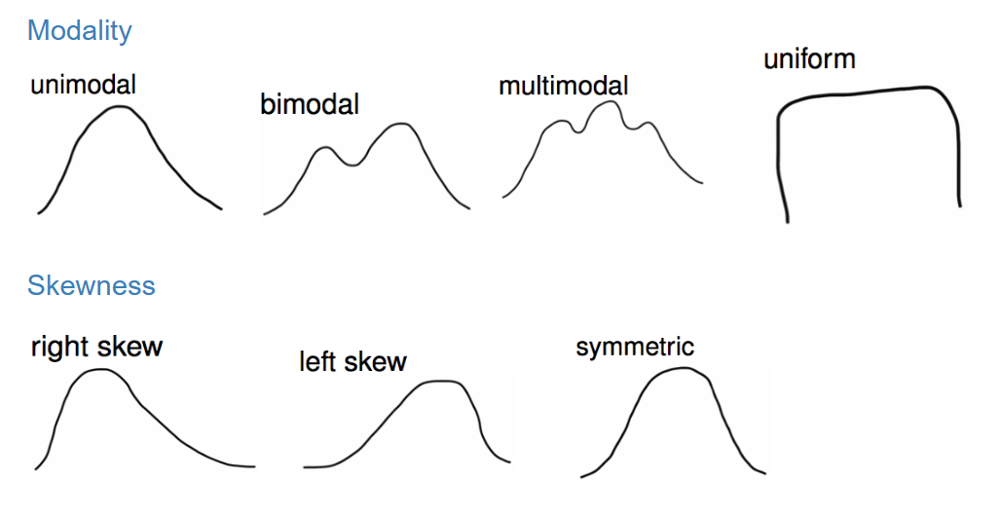
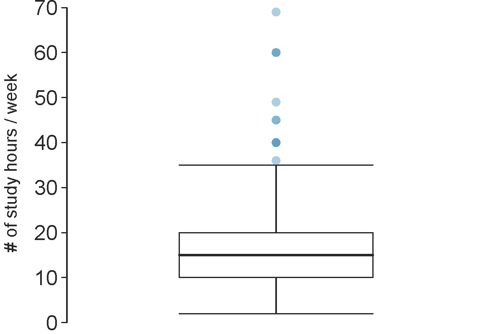
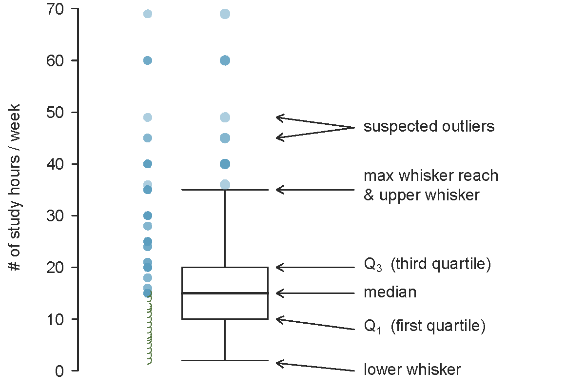
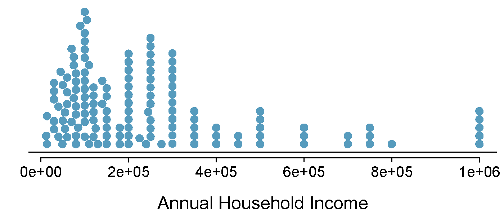
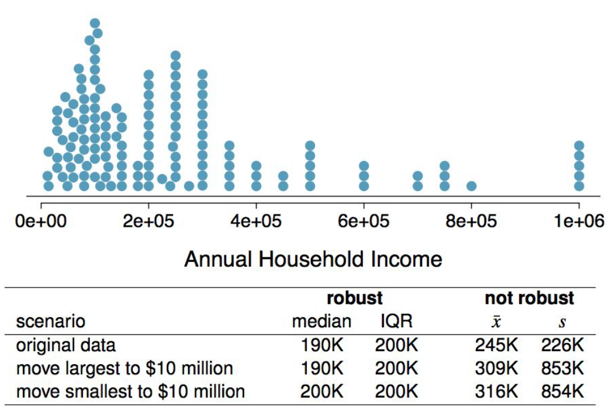

```{r setup, include=FALSE}
knitr::opts_chunk$set(echo = TRUE)
```

## Objectives

:::: {.column width=15%}
::::

:::: {.column width=70%}
- **Know how compute measures central tendency and spread**
- **Understand how the measures describe a distribution**
- **Develop an understanding of robust statistics**
- **Activity: Attendance Sheet and Return of Assessments 1**
::::

:::: {.column width=15%}
::::

*These slides are derived from @diez2012openintro.*

## Previously... (1/2)

**Exploratory Analysis**

It is the process of analyzing and summarizing datasets to uncover patterns, trends, relationships, and anomalies before inference.

**Descriptive statistics**

It involves organizing, summarizing, and presenting data in an informative way. It Focuses on describing and understanding the main features of a dataset.

:::: {.column width=49%}
**For Numerical Variables**

* Measures of Central Tendency
    - **<span style="color:blue;">Mean (Average)</span>**, **<span style="color:blue;">Median</span>**, and **<span style="color:red;">Mode</span>**
* Measures of Dispersion (Spread)
    - **<span style="color:red;">Range</span>**, **<span style="color:red;">Variance</span>**, **<span style="color:red;">Standard Deviation</span>**, **<span style="color:red;">Interquartile Range (IQR)</span>**
::::

:::: {.column width=49%}
**For Categorical Variables**

* **<span style="color:blue;">Frequency</span>**
* **<span style="color:blue;">Relative Frequency (Proportion)</span>**
* Percentage
* Cumulative Frequency
::::

## Previously... (2/2)

**Commonly Observed Distribution Shapes**

```{r shape-distributions, echo=FALSE, eval=TRUE, fig.cap="", fig.align='center', out.width = '90%'}

```

## Measures of Central Tendency (1/3)

**Mode** $<$ **Median** $<$ **Mean**

```{r echo=FALSE, eval=TRUE,message=FALSE, warning=FALSE}
library(tidyverse)
library(openintro)
library(sn)
data(COL)
set.seed(42)
```

:::: {.column width=60%}
```{r echo=FALSE, eval=TRUE,message=FALSE, warning=FALSE, fig.align='center', out.width='100%', fig.width=4, fig.height=3}
N <- 10000
x_rs <- tibble(x = rsn(N, 0, 1, 5))
x_rs_mean <- mean(x_rs$x)
x_rs_median <- median(x_rs$x)
ggplot(x_rs,aes(x=x)) + 
  geom_histogram(bins=30,fill= COL[1,4],alpha=1) + 
  geom_vline(aes(xintercept = x_rs_mean, color="mean"),lwd=1) + 
  geom_vline(aes(xintercept = x_rs_median, color="median"),lwd=1) + 
  geom_vline(aes(xintercept = 1/2, color="mode"),lwd=1) + 
  ggtitle("Right Skew Distribution") + 
  scale_color_manual(name = "", values = c(median="blue",mean="red",mode="black"))
```
::::

:::: {.column width=39%}
* If the distribution of data is **skewed to the right**, the **mode is often less than the median, which is often less than the mean**.
::::

## Measures of Central Tendency (2/3)

**Mean** $<$ **Median** $<$ **Mode**

:::: {.column width=60%}
```{r echo=FALSE, eval=TRUE,message=FALSE, warning=FALSE, fig.align='center', out.width='100%', fig.width=4, fig.height=3}
N <- 10000
x_ls <- tibble(x = rsn(N, 0, 1, -5))
x_ls_mean <- mean(x_ls$x)
x_ls_median <- median(x_ls$x)
ggplot(x_ls,aes(x=x)) + 
  geom_histogram(bins=30,fill= COL[1,4],alpha=1) + 
  geom_vline(aes(xintercept = x_ls_mean, color="mean"),lwd=1) + 
  geom_vline(aes(xintercept = x_ls_median, color="median"),lwd=1) + 
  geom_vline(aes(xintercept = -0.35, color="mode"),lwd=1) + 
  ggtitle("Left Skew Distribution") + 
  scale_color_manual(name = "", values = c(median="blue",mean="red",mode="black"))
```
::::

:::: {.column width=39%}
* If the distribution of data is **skewed to the left**, the **mean is often less than the median, which is often less than the mode**.
::::

## Measures of Central Tendency (3/3)

**Mean** $=$ **Median** $=$ **Mode**

:::: {.column width=60%}
```{r echo=FALSE, eval=TRUE,message=FALSE, warning=FALSE, fig.align='center', out.width='100%', fig.width=4, fig.height=3}
N <- 10000
x_s <- tibble(x = rsn(N, 0, 1, 0))
x_s_mean <- mean(x_s$x)
x_s_median <- median(x_s$x)
ggplot(x_s,aes(x=x)) + 
  geom_histogram(bins=30,fill= COL[1,4],alpha=1) + 
  geom_vline(aes(xintercept = x_s_mean, color="mean"),lwd=1) + 
  geom_vline(aes(xintercept = x_s_median, color="median"),lwd=1) + 
  geom_vline(aes(xintercept = 0, color="mode"),lwd=1) + 
  ggtitle("Symmetric Distribution") + 
  scale_color_manual(name = "", values = c(median="blue",mean="red",mode="black"))
```
::::

:::: {.column width=39%}
* If the distribution of data is **symmetric**, the **mean is often equal to the median, which is often equal to the mode**.
::::

## Variance (1/2)

**Variance** is roughly the average squared deviation from the mean.
$$s^2 = \frac{\sum_{i = 1}^n (x_i - \bar{x})^2}{n - 1}$$

**Example:**

* The sample mean is $\bar{x} = 6.71$, and the sample size is $n = 217$.
* The variance of amount of sleep students get per night can be calculated as:

$$s^2 = \frac{(5 - 6.71)^2 + (9 - 6.71)^2 + \cdots + (7 - 6.71)^2}{217 - 1} = 4.11$$

## Variance (2/2)

**Why do we use the squared deviation in the calculation of variance?**

* To get rid of negatives so that observations equally distant from the mean are weighed equally.
* To weigh larger deviations more heavily.

## Standard Deviation

The **standard deviation** is the square root of the variance, and has the same units as the data.
$$s = \sqrt{s^2}$$

**Example:**

* We know that $s^2 = 4.11$.
* So, the standard deviation is $s = \sqrt{4.11} = 2.03$.

## Q1, Q3, and the IQR

* The **25th percentile** is also called the **first quartile**, $Q1$.
* The **50th percentile** is also called the **median**.
* The **75th percentile** is also called the **third quartile**, $Q3$.
* Between $Q1$ and $Q3$ is the middle 50% of the data. The range these data span is called the interquartile range, or the *IQR*.
$$IQR = Q3 - Q1$$

## Box Plots

The box in a **box plot** represents the middle 50% of the data, and the thick line in the box is the median.

```{r boxplot, echo=FALSE, eval=TRUE, fig.cap="", fig.align='center', out.width = '80%'}

```

## Anatomy of Box Plots

```{r boxplot-layout, echo=FALSE, eval=TRUE, fig.cap="", fig.align='center', out.width = '80%'}

```

## Whiskers and Outliers

**Whiskers** of a box plot can extend up to 1.5 x IQR away from the quartiles.
$$\text{max upper whisker reach = Q3 + 1.5 x IQR}$$
$$\text{max lower whisker reach = Q1 - 1.5 x IQR}$$
$$\text{IQR: 20 - 10 = 10}$$
$$\text{max upper whisker reach = 20 + 1.5 x 10 = 35}$$
$$\text{max lower whisker reach = 10 - 1.5 x 10 = -5}$$

A potential **outlier** is defined as an observation beyond the maximum reach of the whiskers. It is an observation that appears extreme relative to the rest of the data.

## Why Outliers are Important?

**Why is it important to look for outliers?**

* Identify extreme skew in the distribution.
* Identify data collection and entry errors.
* Provide insight into interesting features of the data.

## Extreme Observations

How would sample statistics such as mean, median, SD, and IQR of household income be affected if the largest value was replaced with $10 million? What if the smallest value was replaced with \$10 million?

```{r house_income_dot_stacked, echo=FALSE, eval=TRUE, fig.cap="", fig.align='center', out.width = '80%'}

```

## Robust Statistics (1/2)

```{r robust-table, echo=FALSE, eval=TRUE, fig.cap="", fig.align='center', out.width = '80%'}

```

## Robust Statistics (2/2)

Median and IQR are more robust to skewness and outliers than mean and SD. Therefore,

* for skewed distributions it is often more helpful to use median and IQR to describe the center and spread
* for symmetric distributions it is often more helpful to use the mean and SD to describe the center and spread

## Activity: Attendance Sheet and Return of Assessments 1

1. Make sure you have signed your name on the *F 2/7 Attendance* to take credit for today's lesson. This will be handed out physically.
2. Your Assessments 1 will be returned to you.
3. Assessment 1 retakes are accepted until F 2/14, and you can sign-up here: [Retake Assessment (Lower-Division)](https://calendly.com/alexjohnquijano/retake-or-make-up-exam-quiz-upper-division){target="_blank"}.
4. Please review the [Assessments](https://upmathematics.github.io/mth-161d-sp25/#assessment){target="_blank"} section in the Syllabus regarding retake qualifications and rules.

## References

::: {#refs}
:::
