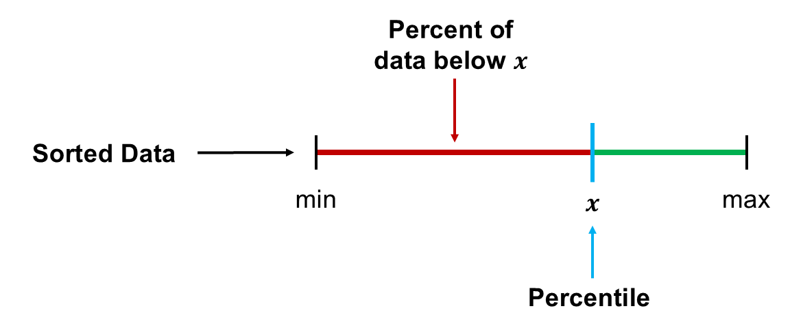
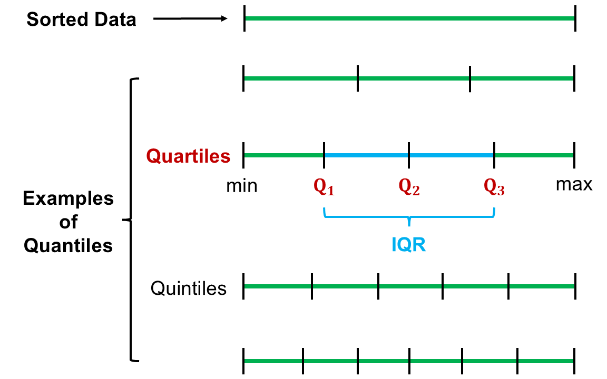

```{r setup, include=FALSE}
knitr::opts_chunk$set(echo = TRUE)
```

```{r echo=FALSE, eval=TRUE,message=FALSE, warning=FALSE}
library(tidyverse)
library(openintro)
library(knitr)
library(sn)
data(COL)
set.seed(42)
```

## Objectives

:::: {.column width=15%}
::::

:::: {.column width=70%}
- **Know how to compute measures of spread**
- **Understand how the measures of spread describe a distribution**
- **Develop an understanding of robust statistics**
- **Activity: Compute Summary Statistics and Visualize Numerical Data**
::::

:::: {.column width=15%}
::::

*These slides are derived from @diez2012openintro.*

## Previously... (1/2)

**Exploratory Analysis**

It is the process of analyzing and summarizing datasets to uncover patterns, trends, relationships, and anomalies before inference.

**Descriptive statistics**

It involves organizing, summarizing, and presenting data in an informative way. It Focuses on describing and understanding the main features of a dataset.

:::: {.column width=49%}
**For Numerical Variables**

* Measures of Central Tendency
    - **<span style="color:blue;">Mean (Average)</span>**, **<span style="color:blue;">Median</span>**, and **<span style="color:blue;">Mode</span>**
* Measures of Dispersion (Spread)
    - **<span style="color:red;">Range</span>**, **<span style="color:red;">Variance</span>**, **<span style="color:red;">Standard Deviation</span>**, **<span style="color:red;">Interquartile Range (IQR)</span>**
::::

:::: {.column width=49%}
**For Categorical Variables**

* **<span style="color:blue;">Frequency</span>**
* **<span style="color:blue;">Relative Frequency (Proportion)</span>**
* Percentage
* Cumulative Frequency
::::

## Previously... (2/2)

**Commonly Observed Distribution Shapes**

```{r shape-distributions, echo=FALSE, eval=TRUE, fig.cap="", fig.align='center', out.width = '90%'}
knitr::include_graphics("shapes.png")
```

## Measures of Dispersion (Spread)

The **measures of dispersion** describes the variability of a numerical data. It is a way to quantify the uncertainty of a distribution. The following are the common measures of dispersion:

* **Variance:** The average squared deviation from the mean.
* **Standard Deviation:** The square root of the variance, providing a measure of spread in the same units as the data.
* **Range:** The difference between the maximum and minimum values.
* **Interquartile Range (IQR):** The difference between the 75th and 25th percentiles, capturing the spread of the middle 50\% of the data.

## Variance

The **variance** is roughly the average squared deviation from the mean.

The formula for the variance is given by $$s^2 = \frac{(x_1 - \bar{x})^2 + (x_2 - \bar{x})^2 + \cdots (x_n - \bar{x})^2}{n-1}$$ where $x_1, x_2, \cdots, x_n$ are the data points, $\bar{x}$ is the sample mean, and $n$ is the sample size.

**What is the meaning of the variance?**

:::: {.column width=15%}
::::

:::: {.column width=70%}
* A measure of how spread out data points are around the mean.
* Indicates the level of uncertainty or variability in a dataset.
::::

:::: {.column width=15%}
::::

## Computing the Variance

**Example:** What is the variance of the data set $7,1,2,4,6,3,2,7$?

:::: {.column width=60%}
* *Manual Computation:*
\[
\begin{aligned}
 \text{mean} \longrightarrow \bar{x} & = \frac{7+1+2+4+6+3+2+7}{8} \\
                                     & = 4
\end{aligned}
\]

\[
\begin{aligned}
 \text{variance} \longrightarrow s^2 & = \frac{\begin{matrix} (7-4)^2 + (1-4)^2 + \\
                                                              (2-4)^2 + (4-4)^2 + \\
                                                              (6-4)^2 + (3-4)^2 + \\
                                                              (2-4)^2 + (7-4)^2
                                               \end{matrix}}{8-1} \\
                                     & = 5.714
\end{aligned}
\]
::::

:::: {.column width=39%}
* *Using R:*
```{r variance-example}
num_data <- c(7,1,2,4,6,3,2,7)
var(num_data)
```
::::

So, the variance is $5.714$.

## Variance is Always Positive

**Why do we use the squared deviation in the calculation of variance?**

:::: {.column width=15%}
::::

:::: {.column width=70%}
* To get rid of negatives so that observations equally distant from the mean are weighed equally.
* To weigh larger deviations more heavily.
::::

:::: {.column width=15%}
::::

::: {style="color: red;"}
$\star$ Variance is the average of the squared differences between each data point and the mean.
:::

## Making Sense of the Variance

**Common variance interpretations:**

* *Zero Variance:* All values are the same.
* *Low Variance:* Data points are close to the mean (consistent data).
* *High Variance:* Data points are spread out (greater variability).

**Example:** Order the following distributions from low to high variance.

```{r echo=FALSE, eval=TRUE}
N <- 1000
mean <- 0
vars <- c(1^2,1.5^2,2^2,2.5^2)

samples <- tibble(
  point = seq(1,N),
  A = rnorm(N,mean,vars[4]),
  B = rnorm(N,mean,vars[1]),
  C = rnorm(N,mean,vars[3]),
  D = rnorm(N,mean,vars[2])
  ) |> 
  pivot_longer(-c(point),
               names_to = "sample",
               values_to = "x")
```

```{r eval=TRUE, echo=FALSE, fig.height=2, fig.width=8, message=FALSE, warning=FALSE, out.width='100%'}
ggplot(samples,aes(x=x,fill=sample)) + 
  geom_histogram(bins=30, fill = COL[1,1]) + 
  facet_grid(cols = vars(sample), scales="fixed") + 
  theme(legend.position="none") + 
  theme_minimal()
```

The above distributions are ordered from lowest to highest variance as follows: B, D, C, and A.

## Standard Deviation (SD)

The **standard deviation (SD)** is the square root of the variance, and has the same units as the data.

The formula for the standard deviation is given by $$s = \sqrt{s^2}$$ where $s^2$ is the variance.

**What is the meaning of the standard deviation?**

:::: {.column width=15%}
::::

:::: {.column width=70%}
* Standard deviation is a measure of how spread out the values in a dataset are.
* It quantifies the amount of variation or dispersion of a set of data points.
* Helps understand data consistency.
::::

:::: {.column width=15%}
::::

## Computing the SD

**Example:** What is the standard deviation of the data set $7,1,2,4,6,3,2,7$?

:::: {.column width=60%}
* *Manual Computation:*

\[
\begin{aligned}
 \text{mean} \longrightarrow \bar{x} & = \frac{7+1+2+4+6+3+2+7}{8} \\
                                     & = 4
\end{aligned}
\]

\[
\begin{aligned}
 \text{variance} \longrightarrow s^2 & = \frac{\begin{matrix} (7-4)^2 + (1-4)^2 + \\
                                                              (2-4)^2 + (4-4)^2 + \\
                                                              (6-4)^2 + (3-4)^2 + \\
                                                              (2-4)^2 + (7-4)^2
                                               \end{matrix}}{8-1} \\
                                     & = 5.714
\end{aligned}
\]

\[
 \text{standard deviation} \longrightarrow s = \sqrt{5.714} = 2.390
\]
::::

:::: {.column width=39%}
* *Using R:*

```{r standard-deviation-example}
num_data <- c(7,1,2,4,6,3,2,7)
sd(num_data)
```
::::

So, the standard deviation is $2.390$.

## Making Sense of the Standard Deviation

**Variance** gives a broader measure of spread, while **standard deviation** provides a more practical understanding of dispersion. 

**Example:** Suppose we analyze the annual salaries of employees in two different companies:

:::: {.column width=60%}
| Company | $\overline{x}$ | $s^2$ | $s$ |
|:---|:---|:---|:---|
| A | \$55K | \$62.5K | \$7.906K |
| B | \$130K | \$2250K | \$47.434K |
::::

:::: {.column width=39%}
* Even though Company B has higher salaries on average, its standard deviation is much larger, suggesting greater salary inequality.
::::

::: {style="color: red;"}
$\star$ Standard deviation helps compare the spread of different distributions of the same units, which is directly interpretable as the typical deviation from the mean.
:::

## Range

The **range** is the difference between the maximum and minimum of the numerical data.

The formula for the range is given by $$\text{range} = x_{max} - x_{min}$$ where $x_{max}$ is the maximum value and $x_{min}$ minimum value.

## Computing the Range

**Example:** What is the range of the data set $7,1,2,4,6,3,2,7$?

:::: {.column width=60%}
* *Manual Computation:*

$$\text{sorted data} \longrightarrow \color{blue}{\mathbf{1}},2,2,3,4,6,7,\color{blue}{\mathbf{7}}$$
\begin{aligned}
 \text{range} & = \color{blue}{\mathbf{7}} - \color{blue}{\mathbf{1}} \\
              & = 6
\end{aligned}
::::

:::: {.column width=39%}
* *Using R:*

```{r range-example}
num_data <- c(7,1,2,4,6,3,2,7)
max(num_data) - min(num_data)
```
::::

So, the range is $6$.

## Percentiles {.smaller}

A **percentile** is a measure used to indicate the value below which a given percentage of observations fall.

The formula for computing the percentile rank and the percentile it given by $$\text{percentile of } x = \frac{\text{number of values below } x}{\text{total number of values}} \times 100$$ where $x$ is a value in the data.

```{r percentiles-diagram, echo=FALSE, eval=TRUE, fig.cap="", fig.align='center', out.width = '60%'}

```

::: {style="color: red;"}
$\star$ **Key Idea:** The percentile is the value below which a certain percentage of the data lies.
:::

## Computing Percentiles

**Example:** What is the percentile of $6$ in the data set $7,1,2,4,6,3,2,7$?

:::: {.column width=60%}
* *Manual Computation:*

$$\text{sorted data} \longrightarrow \color{red}{\mathbf{1}},\color{red}{\mathbf{2}},\color{red}{\mathbf{2}},\color{red}{\mathbf{3}},\color{red}{\mathbf{4}},\color{blue}{\mathbf{6}},7,7$$

\[
\begin{aligned}
\text{percentile of } \color{blue}{\mathbf{6}} & = \frac{5}{8} \times 100 \\
                        & = 62.5
\end{aligned}
\]
::::

So, the data value $6$ is in the $62.5$th percentile, or 62.5\% of the data is below $6$.

## Computing Percentiles in Reverse

**Example:** What is the 30th percentile of the data set $7,1,2,4,6,3,2,7$? (What is the value in the data below which 30\% of the data lies?)

:::: {.column width=60%}
* *Manual Computation:*

\[
\begin{aligned}
30\% & = \frac{\text{number of values below } x}{8} \times 100 \\
0.30 \times 8 & = \text{number of values below } x \\
2.40 & = \text{number of values below } x \\
2 & \longleftarrow  \text{rounded to nearest integer}
\end{aligned}
\]

$$\text{sorted data} \longrightarrow \color{red}{\mathbf{1}},\color{red}{\mathbf{2}},\color{blue}{\mathbf{2}},3,4,6,7,7$$

\[
\begin{aligned}
30\text{th percentile} & \approx 2
\end{aligned}
\]
::::

:::: {.column width=39%}
* *Using R:*

```{r percentile-reverse-example}
num_data <- c(7,1,2,4,6,3,2,7)
quantile(num_data,c(0.30))
```
::::

So, the $30$th percentile is approximately $2$, or precisely $2.1$. This is a consequence of considering a small dataset when computing by hand.

::: {style="color: red;"}
$\star$ **Note:** Whether the $30$th percentile is exactly $2$ or $2.1$ depends on the dataset and the method used to compute percentiles. In fact, $2$ is exactly the $25$th percentile and $2.1$ is exactly the $30$th percentile, but due to approximation, the values are close.
:::

## $\mathbf{Q}_1$, $\mathbf{Q}_2$, $\mathbf{Q}_3$, and the IQR

**$\mathbf{Q}_1$ (the 1st quartile)**, **$\mathbf{Q}_2$ (the 2nd quartile)**, **$\mathbf{Q}_3$ (the 3rd quartile)**, and the **IQR (interquartile range)** are statistical measures used to describe the spread and distribution of a dataset:

* The **1st quartile** is also called the **25th percentile**, $Q_1$.
* The **2nd quartile (median)** is also called the **50th percentile**, $Q_2$.
* The **3rd quartile** is also called the **75th percentile**, $Q_3$.
* Between $Q_1$ and $Q_3$ is the **middle 50\% of the data**. The range these data span is called the **interquartile range**, or the **IQR**.
$$\text{IQR} = Q_3 - Q_1$$

::: {style="color: red;"}
$\star$ **Key Idea:** The numerical data is divided into four sections (quartiles), which is saying that the data is split into four equal parts, each containing 25\% ($Q_1$), 50\% ($Q_2$), and 75\% ($Q_3$) of the observations when arranged in ascending order.
:::

## Quantiles {.smaller}

In general, quartiles are called quantiles, which are values that split sorted data into equal parts. Quartiles are just quantiles where we split the data into four parts.

```{r quantiles-diagram, echo=FALSE, eval=TRUE, fig.cap="", fig.align='center', out.width = '60%'}

```

## Computing the Quartiles

**Example:** What are the quartiles of the data set $7,1,2,4,6,3,2,7$?

:::: {.column width=60%}
* *Manual Computation:*

$$\text{sorted data} \longrightarrow 1,2,2,3,4,6,7,7$$

Note that the number of data points is $8$, an even number.

\[
\begin{aligned}
25\text{th percentile} & \approx 2 \\
50\text{th percentile (median)} & = \frac{3+4}{2} = 3.50 \\
75\text{th percentile} & \approx 6 \\
\end{aligned}
\]

Note that these are approximations due to the small dataset size, but the concept of percentiles still holds.
::::

:::: {.column width=39%}
* *Using R:*

```{r quartiles-example}
num_data <- c(7,1,2,4,6,3,2,7)
quantile(num_data)
```
::::

So, the quartiles are $Q_1 = 2$, $Q_2 = 3.50$, and $Q_3 = 6.25$.

## Computing the IQR

**Example:** What is the IQR of the data set $7,1,2,4,6,3,2,7$?

:::: {.column width=60%}
* *Manual Computation:*

\[
\begin{aligned}
& Q_1 \approx 2 \\
& Q_2 \text{ (median)} = \frac{3+4}{2} = 3.50 \\
& Q_3 \approx 6.25
\end{aligned}
\]

\[
\begin{aligned}
\text{IQR} & = Q_3 - Q_1 \\
           & = 6.25 - 2 \\
           & = 4.25
\end{aligned}
\]
::::

:::: {.column width=39%}
* *Using R:*

```{r iqr-example}
num_data <- c(7,1,2,4,6,3,2,7)
IQR(num_data)
```
::::

So, the IQR is $4.25$.

## Box Plots

The box in a **box plot** represents the middle 50% of the data, and the thick line in the box is the median.

:::: {.column width=50%}
```{r echo=FALSE, eval=TRUE, message=FALSE, warning=FALSE, out.width='100%', fig.cap="Box Plot of Study Hours", fig.width=4,fig.height=2, fig.align='center'}
d <- read.csv("study_hours.csv") |> 
  drop_na()

ggplot(d, aes(x = study_hours)) + 
  geom_boxplot(fill = COL[1,1]) + 
  xlab("# of study hours / week") + 
  theme_minimal() + 
  theme(axis.text.y=element_blank(), 
        axis.ticks.y=element_blank())
  
```
::::

:::: {.column width=49%}
```{r echo=FALSE, eval=TRUE, message=FALSE, warning=FALSE, out.width='100%', fig.cap="Histogram of Study Hours", fig.width=4,fig.height=2, fig.align='center'}
ggplot(d, aes(x=study_hours)) + 
  geom_histogram(binwidth = 5, boundary=-0.5, fill = COL[1,1]) + 
  xlab("# of study hours / week") + 
  theme_minimal()
```
::::

::: {style="color: red;"}
$\star$ **Key Idea:** Box plots and histograms visualize numerical data, with histograms showing distribution shape, while box plots summarize spread and outliers, making them better for comparisons.
:::

## Anatomy of Box Plots

:::: {.column width=55%}
```{r echo=FALSE, eval=TRUE, message=FALSE, warning=FALSE, out.width='100%', fig.width=6,fig.height=5, fig.align='center'}
study_hours <- d$study_hours[!is.na(d$study_hours)]

par(mar=c(0.8,4,0,1), mgp=c(2.8, 0.7, 0), las=1)

boxPlot(study_hours, col = COL[1,3], ylab = "# of study hours / week", axes=FALSE, xlim = c(0,3.5), pch = 20)
axis(2)

arrows(2,1, 1.40,min(study_hours)-0.5, length=0.08)
text(2,1,'lower whisker', pos=4)

arrows(2, 8, 1.40, quantile(study_hours, 0.25), length=0.08)
text(2,8,expression(Q[1]~~'(first quartile)'), pos=4)

m <- median(study_hours)
arrows(2, m, 1.40, m, length=0.08)
text(2,m,'median', pos=4)

q <- quantile(study_hours, 0.75)
arrows(2, q, 1.40, q, length=0.08)
text(2,q,expression(Q[3]~~'(third quartile)'), pos=4)

arrows(2, 35, 1.40, 35, length=0.08)
text(2,35,'max whisker reach\n& upper whisker', pos=4)

arrows(2, 47, 1.40, 45, length=0.08)
arrows(2, 47, 1.40, 49, length=0.08)
text(2,47,'suspected outliers', pos=4)

points(rep(0.4, 99), rev(sort(study_hours))[1:99], cex=rep(1.5, 27), col=rep(COL[1,3], 99), pch=rep(20, 99))
points(rep(0.4, 99), sort(study_hours)[1:99], cex=rep(1, 27), col=rep(COL[2], 99), pch=rep(1, 99))
```
::::

:::: {.column width=44%}
**Main Parts:**

* **Box** 
    - Defined by the quartiles $Q_1$, $Q_2$ (median), and $Q_3$.
    - The IQR defines the length of the Box.
* **Whiskers**
    - Lower whisker is defined as $Q_1 - 1.5 \times \text{IQR}$.
    - Upper whisker is defined as $Q_3 + 1.5 \times \text{IQR}$.
* **Outliers**
    - Data points that are placed beyond the whiskers.
::::

## Computing the Whiskers

**Whiskers** of a box plot can extend up to $1.5 \times IQR$ away from the quartiles. The $1.5 \times \text{IQR}$ is arbitrary, and is considered an academic standard and the default in plotting box plots.

**Example:** Suppose that $Q_1 = 10$ and $Q_3 = 20$.

$$\text{IQR} = 20 - 10 = 10$$
$$\text{max upper whisker reach} = 20 + 1.5 \times 10 = 35$$
$$\text{max lower whisker reach} = 10 - 1.5 \times 10 = -5$$

::: {style="color: red;"}
$\star$ A potential **outlier** is defined as an observation beyond the maximum reach of the whiskers. It is an observation that appears extreme relative to the rest of the data.
:::

## More Boxplot and Dot Plot Examples

**Example:** The boxplot and stacked dot plot of the data set $7,1,2,4,6,3,2,7$ is shown below.

:::: {.column width=50%}
```{r echo=FALSE, eval=TRUE, message=FALSE, warning=FALSE, out.width='100%', fig.cap="Box Plot", fig.width=4,fig.height=2, fig.align='center'}
d <- tibble(x=c(7,1,2,4,6,3,2,7))

ggplot(d, aes(x = x)) + 
  geom_boxplot(fill = COL[1,1]) + 
  xlab("x") + 
  theme_minimal() + 
  theme(axis.text.y=element_blank(), 
        axis.ticks.y=element_blank())
```
::::

:::: {.column width=49%}
```{r echo=FALSE, eval=TRUE, message=FALSE, warning=FALSE, out.width='100%', fig.cap="Stacked Dot Plot", fig.width=4,fig.height=2, fig.align='center'}
ggplot(d, aes(x=x)) + 
  geom_dotplot(binwidth = 0.25, fill = COL[1,1], color = "white") + 
  xlab("x") + 
  theme_minimal() + 
  theme(axis.text.y=element_blank(), 
        axis.ticks.y=element_blank())
```
::::

::: {style="color: red;"}
$\star$ A dot plot is used instead of a histogram for convenience with the small discrete numbered dataset. The box plot shows no potential outliers, as all data points fall within the whiskers.
:::

## Why Outliers are Important?

:::: {.column width=15%}
::::

:::: {.column width=70%}
* Identify extreme skew in the distribution.
* Identify data collection and entry errors.
* Provide insight into interesting features of the data.
::::

:::: {.column width=15%}
::::

## Case Study 1

How would sample statistics such as mean, median, SD, and IQR of household income be affected if the largest value was replaced with $10 million? What if the smallest value was replaced with \$10 million?

```{r echo=FALSE, eval=TRUE, message=FALSE, warning=FALSE, out.width='80%', fig.width=4,fig.height=2, fig.align='center'}
d <- read.csv("house_income.csv") |> 
  drop_na() |> 
  filter(house_income < 4000000)

ggplot(d, aes(x=house_income)) + 
  geom_histogram(bins = 20, boundary=-0.5, fill = COL[1,1], color = "white") + 
  xlab("Annual Household Income") + 
  theme_minimal() + 
  theme(axis.text.y=element_blank(), 
        axis.ticks.y=element_blank())
```

## Case Study 1: Extreme Observations

```{r echo=FALSE, eval=TRUE}
d <- read.csv("house_income.csv") |> 
  drop_na() |> 
  filter(house_income < 4000000) |> 
  mutate(data = rep("original",n()))
d_max10 <- d |> 
  mutate(house_income=ifelse(house_income==max(house_income),10000000,house_income)) |> 
  mutate(data = rep("replace largest with $10M",n()))
d_min10 <- d |> 
  mutate(house_income=ifelse(house_income==min(house_income),10000000,house_income)) |> 
  mutate(data = rep("replace smallest with $10M",n()))
d_all <- rbind(d,d_max10,d_min10)
d_all_summaries <- d_all |> 
  group_by(data) |> 
  summarise(
    `$\\overline{x}$` = mean(house_income),
    `$s$` = sd(house_income),
    Median = median(house_income),
    IQR = IQR(house_income)
  ) |> 
  mutate(`$\\overline{x}$` = format(`$\\overline{x}$`,big.mark=",",scientific=FALSE),
         `$s$` = format(`$s$`,big.mark=",",scientific=FALSE),
         Median = format(Median,big.mark=",",scientific=FALSE),
         IQR = format(IQR,big.mark=",",scientific=FALSE))
```

```{r echo=FALSE, eval=TRUE, message=FALSE, warning=FALSE, fig.align='center'}
kable(d_all_summaries)
```

::: {style="color: red;"}
$\star$ The table shows that shifting specific values to the extreme significantly affects the mean but not the median, indicating the mean's sensitivity to extreme observations. Similarly, the standard deviation is affected, while the IQR remains the same.
:::

## Robust Statistics

Median and IQR are more robust to skewness and outliers than mean and SD. Therefore,

:::: {.column width=15%}
::::

:::: {.column width=70%}
* for skewed distributions it is often more helpful to use median and IQR to describe the center and spread
* for symmetric distributions it is often more helpful to use the mean and SD to describe the center and spread
::::

:::: {.column width=15%}
::::

## Activity: Compute Summary Statistics and Visualize Numerical Data

1. Make sure you have a copy of the *F 2/7 Worksheet*. This will be handed out physically and it is also digitally available on Moodle.
2. Work on your worksheet by yourself for 10 minutes. Please read the instructions carefully. Ask questions if anything need clarifications.
3. Get together with another student.
4. Discuss your results.
5. Submit your worksheet on Moodle as a `.pdf` file.

## References

::: {#refs}
:::
