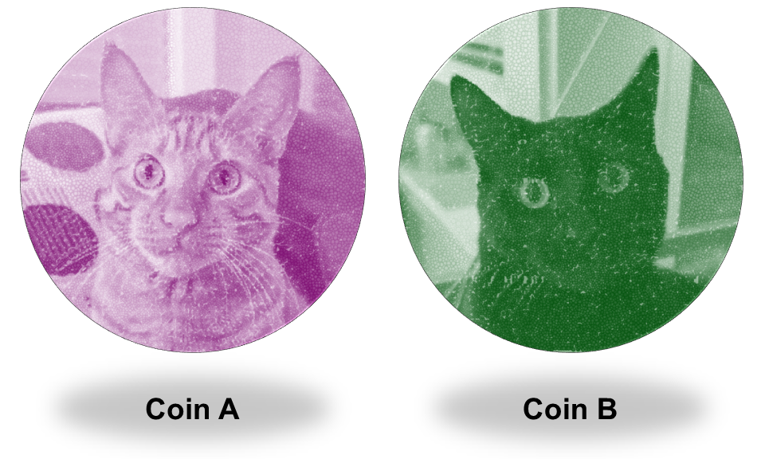
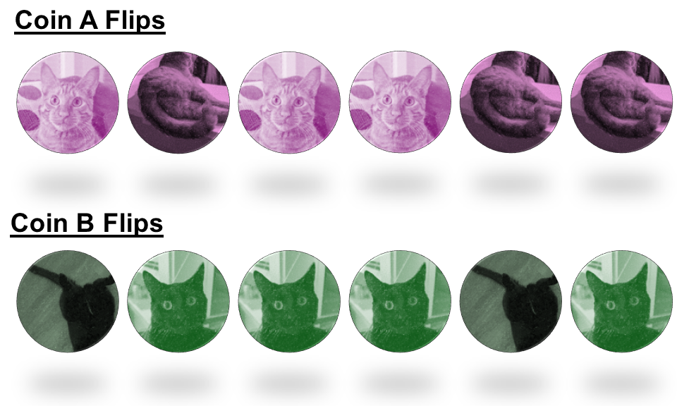
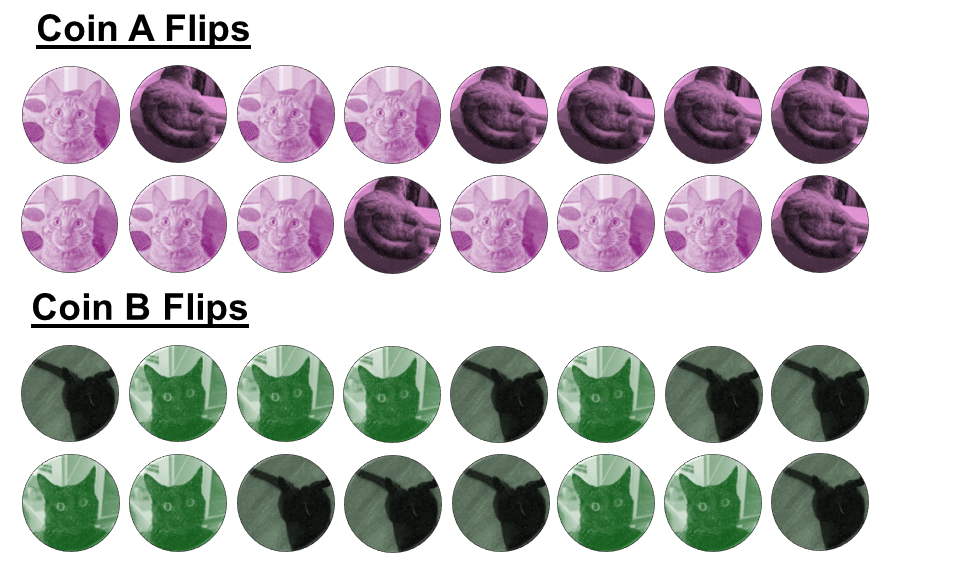

```{r setup, include=FALSE}
knitr::opts_chunk$set(echo = FALSE)
```

```{r echo=FALSE, eval=TRUE,message=FALSE, warning=FALSE}
library(tidyverse)
library(openintro)
library(knitr)
library(gridExtra)
data(COL)
set.seed(42)
```

## Objectives

:::: {.column width=15%}
::::

:::: {.column width=70%}
- **Develop an understanding about the types of inference**
- **Know the difference between population parameter and sample statistic**
- **Understand how inferential conclusions are made**
- **Activity: Distinguish Between Estimation and Testing**
::::

:::: {.column width=15%}
::::

*These slides are derived from @diez2012openintro.*

## Previously... (1/3)

**Descriptive statistics**

It involves organizing, summarizing, and presenting data in an informative way. It Focuses on describing and understanding the main features of a dataset.

:::: {.column width=49%}
**For Numerical Variables**

* Measures of Central Tendency
    - **<span style="color:blue;">Mean (Average)</span>**, **<span style="color:blue;">Median</span>**, and **<span style="color:blue;">Mode</span>**
* Measures of Dispersion (Spread)
    - **<span style="color:blue;">Range</span>**, **<span style="color:blue;">Variance</span>**, **<span style="color:blue;">Standard Deviation</span>**, **<span style="color:blue;">Interquartile Range (IQR)</span>**
::::

:::: {.column width=49%}
**For Categorical Variables**

* **<span style="color:blue;">Frequency</span>**
* **<span style="color:blue;">Relative Frequency (Proportion)</span>**
* **<span style="color:blue;">Percentage</span>**
* **<span style="color:blue;">Cumulative Frequency</span>**
::::

## Previously... (2/3)

**Exploratory Analysis**

It is the process of analyzing and summarizing datasets to uncover patterns, trends, relationships, and anomalies before inference.

**Inference**

It is the process of drawing conclusions about a population based on sample data. This involves using data from a sample to make generalizations, predictions, or decisions about a larger group.

## Previously... (3/3)

The guiding principle of statistics is statistical thinking.

```{r statistical-thinking-1, echo=FALSE, fig.cap="Statistical Thinking in the Data Science Life Cycle", fig.align='center', out.width = '55%'}
knitr::include_graphics("statistical-thinking-in-data-science-lifecycle.png")
```

## Toy Example

**Suppose you have two coins. Which of the two coins are fair?**

```{r coin, echo=FALSE, fig.cap="", fig.align='center', out.width = '30%'}

```

**What is a fair coin?** There are only *two possible outcomes* of each coin: *head* or *tail*, but not both. A fair coin means that if you flip it, the *chances* of getting a head or tail is *equally likely*.

::: {style="color: blue;"}
$\dagger$ How would you know which coin is fair if they are "similar" in appearance and weight?
:::

## Toy Example: Coin Flips

**Flip the coin $6$ times.**

:::: {.column width=49%}
**Data:**

```{r coin-flips, echo=FALSE, fig.cap="", fig.align='center', out.width = '100%'}

```
::::

:::: {.column width=50%}
**Sample Proportion of Heads:**

* *Coin A:* $\frac{3}{6} = 0.50$.
* *Coin B:* $\frac{4}{6} \approx 0.667$.
::::

::: {style="color: blue;"}
$\dagger$ If we flip the coins more and add it into the totals, will the proportion of heads change?
:::

## Toy Example: True vs Sample Proportion

**Flip the coin $16$ times.**

:::: {.column width=49%}
**Data:**

```{r coin-flips-more, echo=FALSE, fig.cap="", fig.align='center', out.width = '100%'}

```
::::

:::: {.column width=50%}
**Sample Proportion of Heads:**

* *Coin A:* $\frac{9}{16} \approx 0.563$.
* *Coin B:* $\frac{8}{16} = 0.50$.

**True Proportion of Heads:** We don't know the true proportion of heads for each coin or which one is fair, but we know a fair coin should yield a 0.50 proportion of heads.
::::

::: {style="color: red;"}
$\star$ **Key Idea:** The goal of parameter estimation is to determine the true proportion of heads for coins A and B, accounting for uncertainty from random sampling (coin flips).
:::

::: {style="color: blue;"}
$\dagger$ How many coin flips should you do until you are certain which one is the fair coin?
:::

## Probability is the Basis for Inference

* **Probability** provides a framework for drawing conclusions about a population from a sample.
* It helps **quantify uncertainty in estimates and decisions**.
    - Sampling distributions: Describe how statistics (e.g., sample mean) behave over repeated samples.
    - Law of Large Numbers (LLN): Guarantees that sample estimates converge to the true population value as sample size increases.
    - Central Limit Theorem (CLT): States that the sampling distribution of the sample mean approaches normality for large sample sizes, regardless of the population distribution.

::: {style="color: red;"}
$\star$ **Key Idea:** Probability bridges the gap between sample data and population conclusions.
:::

## Toy Example: Which of the two coins are fair?

Once we estimate the true proportion of heads, we can test which coin is fair through hypothesis testing. We can frame the test in two ways:

:::: {.column width=49%}
**Way 1**

* *Null hypothesis:* The true proportion of heads of coin B (or A) is $0.50$.
* *Alternative hypothesis:* the true proportion of heads of coin B (or A) is not $0.50$.
::::

:::: {.column width=50%}
**Way 2:**

* *Null Hypothesis:* The true proportion of heads of coin A is equal to coin B.
* *Alternative Hypothesis:* The true proportion of heads of coin A is not equal to coin B
:::

::: {style="color: red;"}
$\star$ **Key Idea:** Hypothesis testing involves two opposing statements: the null hypothesis and the alternative hypothesis, which we aim to test.
:::

## The P-Value is a Probability

* The **p-value** measures the **strength of evidence against the null hypothesis**.
* It represents the probability of observing data as extreme (or more extreme) than the sample data, assuming the null hypothesis is true.
* Interpretation:
    - *Small p-value:* Strong evidence against the null hypothesis.
    - *Large p-value:* Insufficient evidence to reject the null hypothesis.
* The p-value does *not* measure:
    - The probability that the null hypothesis is true.
    - The magnitude of an effect.

::: {style="color: red;"}
$\star$ **Key Idea:** The p-value quantifies how surprising the sample data is under the assumption that the null hypothesis is true.
:::

## Types of Inference

|  | **Parameter Estimation** | **Hypothesis Testing** |
|:---|:------|:------|
| _Goal_ | Estimate an unknown population value | Assess claims about a population value |
| _Methods_ | Point Estimation: A single value estimate (e.g., sample mean) <br>Interval Estimation: A range of plausible values (e.g., confidence interval) | State a null and an alternative hypothesis <br>Compute a test statistic and compare it to a threshold (p-value or critical value) |
| _Key Concept_ | Focuses on precision in estimation (confidence intervals) | Focuses on decision-making based on evidence (reject or fail to reject the null hypothesis) |

::: {style="color: red;"}
$\star$ **Key Idea:** Parameter estimation focuses on finding the best estimate of an unknown population value, while hypothesis testing determines whether there is enough evidence to support or reject a claim about the population.
:::

## Activity: Distinguish Between Estimation and Testing

1. Make sure you have a copy of the *W 2/12 Worksheet*. This will be handed out physically and it is also digitally available on Moodle.
2. Work on your worksheet by yourself for 10 minutes. Please read the instructions carefully. Ask questions if anything need clarifications.
3. Get together with another student.
4. Discuss your results.
5. Submit your worksheet on Moodle as a `.pdf` file.

## References

::: {#refs}
:::
