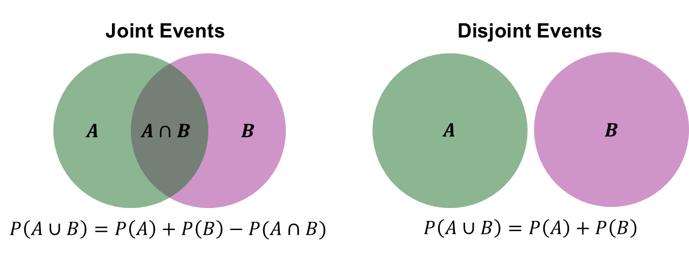

```{r setup, include=FALSE}
knitr::opts_chunk$set(echo = FALSE)
```

```{r echo=FALSE, eval=TRUE,message=FALSE, warning=FALSE}
library(tidyverse)
library(openintro)
data(COL)
seed <- 42
```

## Objectives

:::: {.column width=15%}
::::

:::: {.column width=70%}
- **Introduce basic probability rules**
- **Know how to compute probabilities using the basic rules**
- **Develop an understanding of interpreting probability**
- **Activity: Taking Samples from Dice Rolls**
::::

:::: {.column width=15%}
::::

*These slides are derived from @diez2012openintro.*

## Previously... (1/2)

The guiding principle of statistics is statistical thinking.

```{r statistical-thinking-1, echo=FALSE, fig.cap="Statistical Thinking in the Data Science Life Cycle", fig.align='center', out.width = '55%'}
knitr::include_graphics("statistical-thinking-in-data-science-lifecycle.png")
```

## Previously... (2/2)

**Probability is the Basis for Inference**

* **Probability** provides a framework for drawing conclusions about a population from a sample.
* It helps **quantify uncertainty in estimates and decisions**.

**The P-Value is a Probability**

* The **p-value** measures the **strength of evidence against the null hypothesis**.

## Probability and Statistics

:::: {.column width=49%}
**Probability**

  * A measure on how likely an event occurs
  * Computing probabilities have specific rules
  * Logical reasoning
  * One answer
::::

:::: {.column width=50%}
**Statistics**

  * It's an art and science
  * Collecting, analyzing, interpreting, and presenting data
  * Data-driven approach to make conclusions and prediction
  * Multiple ways to solve problems
::::

## Basic Probability Definition

**Probability** is the branch of mathematics that deals with randomness. The *likelihood* of an outcome happening.

An extent to which an outcome is likely to occur is $$\text{probability} = \frac{\text{number of favorable outcomes}}{\text{total number of outcomes}}.$$

## Coin

**Fair Coin**

* *Possible outcomes:* $H$ or $T$ ($H$ for heads, $T$ for tails)
* *Total number of possible outcomes:* $2$
* *Probabilities:*
\[
\begin{aligned}
\text{probability of } H & = \frac{1}{2} \\
\text{probability of } T & = \frac{1}{2}
\end{aligned}
\]

## Dice

**Fair Dice**

* *Possible outcomes:* 1 (&#9856;), 2 (&#9857;), 3 (&#9858;), 4 (&#9859;), 5 (&#9860;), or 6 (&#9861;)
* *Total number of possible outcomes:* $6$
* *Probabilities:*
\[
\begin{aligned}
\text{probability of } 1 & = \frac{1}{6} & \text{probability of } 4 & = \frac{1}{6} \\
\text{probability of } 2 & = \frac{1}{6} & \text{probability of } 5 & = \frac{1}{6} \\
\text{probability of } 3 & = \frac{1}{6} & \text{probability of } 6 & = \frac{1}{6}
\end{aligned}
\]

## Standard Deck of Cards

**52-Card Deck** 

* *Possible outcomes:* The four suits are Hearts (♥), Diamonds (♦), Clubs (♣), Spades (♠). Each suit has 13 ranks: Ace (A), 2, 3, 4, 5, 6, 7, 8, 9, 10, Jack (J), Queen (Q), and King (K).
* *Total number of possible outcomes:* $52$
* *Probabilities:*
\[
\text{probability of Q of Hearts } = \frac{1}{52}
\]
Actually, the probability of any card drawn once is $\frac{1}{52}$.

## Probability Notations (1/2)

We will use **specific words** for outcomes.

* A set of possible outcomes is called the **sample space**.
* Any subset of $S$ are called **events**.
* An **event space** is a set all subsets of outcomes of the sample space.

**Fair Coin Example:**

* Sample space: $S = \{H,T\}$
* Events space: $\{H\}$, $\{T\}$, $\{H,T\}$, $\emptyset$
* Two events from $S$: $\{H\}$ and $\{T\}$

## Probability Notations (2/2)

We will use **specific notations** for probabilities.

Let $A$ be an event with a finite sample space $S$. The probability of $A$ is $$P(A) = \frac{|A|}{|S|} \longrightarrow P(A) = \frac{\text{number of outcome favorable to } A}{\text{total number of outcomes in } S}.$$

**Fair Coin Example:**

\[
\begin{aligned}
\text{probability of } H & = \frac{1}{2} \longrightarrow P(H) = \frac{1}{2} \\
\text{probability of } T & = \frac{1}{2} \longrightarrow P(T) = \frac{1}{2}
\end{aligned}
\]

## Independence

Two events, $A$ and $B$, are **independent** if the **occurrence of one does not affect the probability of the other**: $$P(A \text{ and } B) = P(A)P(B)$$

If the event $B$ is **dependent** on $A$, then $$P(A \text{ and } B) \ne P(A)P(B)$$

::: {style="color: red;"}
$\star$ **Key Idea:** Independent events is when one event happening does not affect the other. Disjoint events is when one event happening prevents the other.
:::

## Coin Flips

Suppose we conduct an experiment of flipping fair coins in sequence and record the outcomes.

* One Coin: $H$ or $T$ (two possible outcomes)
  - $P(H) = \frac{1}{2}$ and $P(T) = \frac{1}{2}$ but $P(H \text{ and } T) = 0$ because they can't occur simultaneously

* Two Coins: $HH$, $HT$, $TH$, or $TT$ (four possible outcomes)
  - $P(H \text{ and } H) = P(H)P(H) = \left( \frac{1}{2} \right) \left( \frac{1}{2} \right) = \left( \frac{1}{4} \right)$ because each flip is independent
  - $P(H \text{ and } T) = P(H)P(T) = \left( \frac{1}{2} \right) \left( \frac{1}{2} \right) = \left( \frac{1}{4} \right)$
  - $P(T \text{ and } H) = P(T)P(H) = \left( \frac{1}{2} \right) \left( \frac{1}{2} \right) = \left( \frac{1}{4} \right)$
  - $P(T \text{ and } T) = P(T)P(T) = \left( \frac{1}{2} \right) \left( \frac{1}{2} \right) = \left( \frac{1}{4} \right)$
  
::: {style="color: blue;"}
$\dagger$ How many possible outcomes are there for three coins and what are the probabilities? 
:::

## Disjoint and Joint Events

Two events, $A$ and $B$, are **disjoint** (or **mutually exclusive**) if they **cannot occur at the same time**: $$P(A \text{ and } B) = 0.$$

Two event, $A$ and $B$ are **joint** if they can happen together: $$P(A \text{ and } B) \ne 0$$

**Fair Coin Example:**

* $S = \{H,T\}$
* $P(H \text{ and } T) = 0$ since $H$ and $T$ outcomes cannot occur simultaneously in one flip

## Union of Events

The **union** of two events, $A$ and $B$, is the **event that at least one of them occurs**: $$P(A \text{ or } B) = P(A) + P(B) - P(A \text{ and } B)$$

If $A$ and $B$ are disjoint, then $$P(A \text{ or } B) = P(A) + P(B)$$

::: {style="color: red;"}
$\star$ **Key Idea:** The probability of the union is the sum of individual probabilities minus their intersection (to avoid double-counting).
:::

## Joint vs Disjoint Venn Diagram

```{r join-disjoint-venn-diagram, echo=FALSE, fig.cap="", out.width="90%", fig.align="center"}

```

## Drawing Cards

Suppose we conduct an experiment of drawing specific characteristics of a card from a 52-card deck.

* Let $A$ be the event that we draw a Queen.
* Let $B$ be the event that we draw a Heart.
* Events $A$ and $B$ are joint.
    - $P(A \text{ and } B) = \frac{1}{52}$ (Queen of Hearts).
* We know that there are 4 Queens and 13 Hearts.
    - $P(A) = \frac{4}{52}$, $P(B) = \frac{13}{52}$, and 
    - $P(A \text{ or } B) = P(A) + P(B) - P(A \text{ and } B) = \frac{4}{52} + \frac{13}{52} - \frac{1}{52} = \frac{16}{52}$

::: {style="color: blue;"}
$\dagger$ Can you compute the probability of drawing a face card (Ace, Jack, Queen, King) or a Diamond?
:::

## Dice Rolls

Suppose we conduct an experiment of rolling two six-sided dice and sum the outcomes.

* Each dice has six outcomes: 1 (&#9856;), 2 (&#9857;), 3 (&#9858;), 4 (&#9859;), 5 (&#9860;), or 6 (&#9861;)
* Let $A$ be the event of the 1st dice.
* Let $B$ be the event of the 2nd dice.
* The outcome we are interested in is the sum of $A$ and $B$. So, the sample space has 36 total possible outcomes.
    - The probability of getting a sum of 3 is $$\begin{aligned} P(3) & = P(1 \text{ and } 2) + P(2 \text{ and } 1) \\ & = P(1)P(2) + P(2)P(1) \\ & = \left( \frac{1}{6} \right) \left( \frac{1}{6} \right) + \left( \frac{1}{6} \right) \left( \frac{1}{6} \right) \\ & = 2 \times \left( \frac{1}{6} \right) \left( \frac{1}{6} \right) \\ & = \frac{2}{36} \end{aligned}$$ because of independence and joint events.

::: {style="color: blue;"}
$\dagger$ Can you compute the probability of rolling a sum of 4?
:::

## Summary of Basic Probability Rules

**Basic Rules**

| **Rule** | **Formula** |
|:---|:------|
| *Independence* | $P(A \text{ and } B) = P(A)P(B)$ |
| *Joint (Union)* | $P(A \text{ or } B) = P(A) + P(B) - P(A \text{ and } B)$ |
| *Disjoint* | $P(A \text{ and } B) = 0$ |
| *Complement* | If $P(A) + P(B) = 1$, then $1-P(A)=P(B)$. |

## Probability Axioms

| **Axiom** | **Statement** |
|:---|:------|
| $P(S) = 1$ | The sum of the probabilities for all outcomes in the sample space is equal to 1. |
| $P \in [0,1]$ | Probabilities are always positive and always between $0$ and $1$. |
| $P(A \text{ or } B) = P(A) + P(B)$ | If events A and B are disjoint (mutually exclusive), then their probabilities can be added. |

## Interpreting Probability

**Frequentist probability** refers to the interpretation of probability based on the long-run frequency of an event occurring in repeated trials or experiments.

**Coin Flipping Example**

Suppose we conduct an experiment where we repeatedly flip a fair coin ($P(H) = 0.50$), tracking the cumulative count of $H$ and its proportion after each flip.

```{r echo=FALSE, eval=TRUE, fig.align='center', out.width='70%', message=FALSE, warning=FALSE}
knitr::include_graphics("cumulative-fair-coin-flips-sim.gif")
```

::: {style="color: red;"}
$\star$ **Key Idea:** As the number of flips (samples) increases the proportion of H gets closer and closer to the true proportion of H, which is $P(H)=0.50$.
:::

## Activity: Taking Samples from Dice Rolls

1. Make sure you have a copy of the *W 2/19 Worksheet*. This will be handed out physically and it is also digitally available on Moodle.
2. Work on your worksheet by yourself for 10 minutes. Please read the instructions carefully. Ask questions if anything need clarifications.
3. Get together with another student.
4. Discuss your results.
5. Submit your worksheet on Moodle as a `.pdf` file.

## References

::: {#refs}
:::
