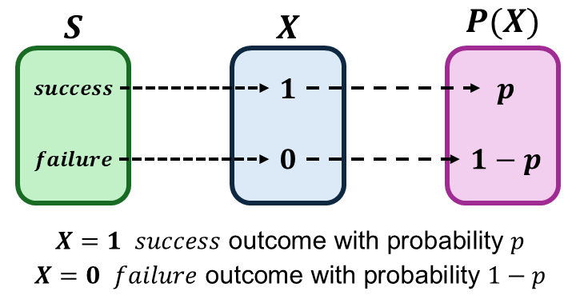

```{r setup, include=FALSE}
knitr::opts_chunk$set(echo = FALSE)
```

```{r echo=FALSE, eval=TRUE,message=FALSE, warning=FALSE}
library(tidyverse)
library(openintro)
data(COL)
seed <- 42
```

## Objectives

:::: {.column width=15%}
::::

:::: {.column width=70%}
- **Introduce the binomial distribution**
- **Know how to compute binomial probabilities**
- **Develop an understanding of the binomial random variable**
- **Activity: Observing the Binomial Distribution**
::::

:::: {.column width=15%}
::::

*These slides are derived from @diez2012openintro.*

## Previously... (1/3)

**Basic Definition of Probability**

Let $A$ be an event with a finite sample space $S$. The probability of $A$ is $$P(A) = \frac{|A|}{|S|} \longrightarrow P(A) = \frac{\text{number of outcome favorable to } A}{\text{total number of outcomes in } S}.$$

## Previously... (2/3)

**Basic Rules**

| **Rule** | **Formula** |
|:---|:------|
| *Independence* | $P(A \text{ and } B) = P(A)P(B)$ |
| *Joint (Union)* | $P(A \text{ or } B) = P(A) + P(B) - P(A \text{ and } B)$ |
| *Disjoint* | $P(A \text{ and } B) = 0$ |
| *Complement* | If $P(A) + P(B) = 1$, then $1-P(A)=P(B)$. |

## Previously... (3/3)

**Interpreting Probability**

Frequentist probability refers to the interpretation of probability based on the long-run frequency of an event occurring in repeated trials or experiments.

**Coin Flipping Example**

```{r echo=FALSE, eval=TRUE, fig.align='center', out.width='70%', message=FALSE, warning=FALSE}

```

## Reminders (1/2): Central Theme of Statistics

The guiding principle of statistics is statistical thinking.

```{r statistical-thinking-1, echo=FALSE, fig.cap="Statistical Thinking in the Data Science Life Cycle", fig.align='center', out.width = '55%'}
knitr::include_graphics("statistical-thinking-in-data-science-lifecycle.png")
```

## Reminders (2/2): Central Motivation of Probability in Statistics

**Probability is the Basis for Inference**

* **Probability** provides a framework for drawing conclusions about a population from a sample.
* It helps **quantify uncertainty in estimates and decisions**.

**The P-Value is a Probability**

* The **p-value** measures the **strength of evidence against the null hypothesis**.

## Warm-Up Basic Probability Problem

A hospital is conducting a study on two different diseases: Disease A and Disease B. Among a randomly selected group of patients, the probabilities are as follows:

* The probability that a patient has Disease A is $P(A) = 0.35$.
* The probability that a patient has Disease B is $P(B) = 0.25$.
* The probability that a patient has both Disease A and Disease B is $P(A \text{ and } B) = 0.10$

1. Are having Disease A and Disease B independent events? Justify your answer mathematically.
2. What is the probability that a randomly chosen patient has at least one of the two diseases?
3. What is the probability that a randomly chosen patient has neither Disease A nor Disease B?

## Random Variables

A **random variable (r.v)** is a numerical outcome of a random experiment. It assigns a number to each possible outcome in a sample space.

In other words, a random variable is **a function that maps the sample space into real numbers**.

**Types:**

* *Discrete Random Variable:* Takes on a countable number of outcomes
* *Continuous Random Variable:* Takes on any value of outcomes in an interval

::: {style="color: red;"}
$\star$ **Key Idea:** R.V. provides a way to assign numerical values to outcomes in a sample space, allowing us to analyze and compute probabilities in a structured manner
:::

## Probability Functions

A **probability function** assigns probabilities to outcomes in a sample space.

In other words, a probability function **maps the r.v. into the the real numbers between 0 and 1**.

**Types:**

* *Probability Mass Function (PMF):* PMFs are for discrete random variables
* *Probability Density Functions (PDF):* PDFs are for continuous random variables

::: {style="color: red;"}
$\star$ **Key Idea:** We can define a probability function directly from the sample space, but using a random variable makes it explicit what outcomes we want to compute probabilities for in a given scenario.
:::

## Flipping One Coin R.V.

Suppose we conduct an experiment of flipping a fair coin once.

:::: {.column width=49%}
* Let $S = \{H,T\}$ be the sample space.
* Let $X$ be the r.v. that counts the number of $H$ outcomes.
* The r.v. is given by
\[
\begin{aligned}
X(H) & = 1 \\
X(T) & = 0 \\
\end{aligned}
\]
::::

:::: {.column width=50%}
```{r one-coin-toss-rv, echo=FALSE, fig.cap="", out.width="95%", fig.align="center"}

```
::::

::: {style="color: red;"}
$\star$ **Key Idea:** A random variable for a coin toss maps the sample space $\{H,T\}$ to real values, assigning $X(H)=1$ and $X(T)=0$. The probability function $P(X)$ then defines the probability space.
:::

## R.V. of Binary Outcomes

Suppose we conduct an experiment of one randomized outcome from a binary r.v..

A **binary r.v.** $X$ is a variable that takes only two possible values, typically labelled as "success" and "failure".

:::: {.column width=49%}
* Let $S = \{\text{success},\text{failure}\}$ be the sample space.
* The r.v. is given by
\[
\begin{aligned}
X(\text{success}) & = 1 \\
X(\text{failure}) & = 0 \\
\end{aligned}
\]
::::

:::: {.column width=50%}
```{r binary-rv, echo=FALSE, fig.cap="", out.width="95%", fig.align="center"}

```
::::

::: {style="color: red;"}
$\star$ **Key Idea:** A r.v. with binary outcome is called the **Bernoulli R.V.** with a probability of "success" $p$ and "failure" $1-p$, where $p$ is called the *parameter*. One trial with binary outcomes is called a **Bernoulli trial**.
:::

## The Bernoulli R.V. and PMF

A **Bernoulli r.v.** represents a single experiment with two possible outcomes: "success" ($X=1$) with probability $p$ and failure ($X=0$) with probability $1-p$. We typically define an r.v. using $\sim$ along with the name and its parameter: $$X \sim \text{Bern}(p)$$

The **Bernoulli distribution** is a **probability mass function** that computes the probability of the Bernoulli r.v..

$$
P(X = x) = 
\begin{cases}
p & \text{, if } x = 1 \\
1-p & \text{, if } x = 0
\end{cases}.
$$

where $p$ is the parameter (also the probability of "success").

## Case Study 1

A hospital is testing a new antibiotic for treating bacterial pneumonia. Researchers conduct a clinical trial where patients receive either the new antibiotic or a standard treatment, and their recovery outcomes are recorded.

:::: {.column width=49%}
**Binary Outcome:**

* Each patient's response to treatment is categorized as:
  - Recovered --Patient shows no signs of infection after treatment
  - Not Recovered --Infection persists or worsens
::::

:::: {.column width=50%}
**Data Collection & Analysis:**

* *Patients divided into two groups:* New antibiotic vs. Standard treatment
* *Binary Outcomes:* Recovery sample proportions compared
* *Key Research Question:* Does the new antibiotic significantly improve recoveries compared to the standard treatment?
::::

::: {style="color: red;"}
$\star$ **Key Idea:** This example is simplified and it serves the building block of all statistical studies, which includes observational and experimental studies.
:::

## Flipping Two Coins R.V.

Suppose we conduct an experiment of flipping two fair coins in a sequence.

:::: {.column width=49%}
* We know that one coin has two possible outcomes $\{H,T\}$.
* Let $S = \{TT,TH,HT,TT\}$ be the sample space.
* Let $X$ be the r.v. that counts the number of $H$ outcomes.
* The r.v. is given by
\[
\begin{aligned}
X(TT) = 0 & & X(TH) = 1 \\
X(HT) = 1 & & X(HH) = 2 \\
\end{aligned}
\]
::::

:::: {.column width=50%}
```{r two-coin-toss-rv, echo=FALSE, fig.cap="", out.width="95%", fig.align="center"}

```
::::

::: {style="color: red;"}
$\star$ **Key Idea:** The PMF $P(X)$ satisfies the probability axioms, and the collection of all probabilities forms the probability distribution.
:::

## Flipping $\mathbf{n}$ Coins: Possible Outcomes

Suppose we conduct an experiment of flipping $n$ fair coins in a sequence, where $n$ is an integer. The sample space $S$ contains all possible sequences of $H$ and $T$. Number of possible outcomes is $|S| = 2^n$.

**Visualizing the possible outcomes using Pascal's triangle**

```{r pascals-triangle-row-sum, echo=FALSE, fig.cap="", out.width="60%", fig.align="center"}
knitr::include_graphics("pascals-triangle-row-sum.png")
```

::: {style="color: red;"}
$\star$ **Key Idea:** Pascal's Triangle helps us visualize the total possible sequences of "success" ($H$) outcomes given $n$ independent trials.
:::

## Flipping $\mathbf{n}$ Coins: Counting the Number of $H$ outcomes

Let $X$ be the r.v. that counts the number of $H$ outcomes in $n$ trials.

**Pascal's triangle helps us count**

```{r pascals-triangle-2trial-comb, echo=FALSE, fig.cap="", out.width="60%", fig.align="center"}
knitr::include_graphics("pascals-triangle-2trial-comb.png")
```

::: {style="color: blue;"}
$\dagger$ Can you determine the ways $H$ can occur in $4$ trials using Pascal's triangle?
:::

## Flipping $\mathbf{n}$ Coins: Probability of Observing $H$ outcomes in $n$ Trials

Compute the probability of observing a certain number of "success" ($H$) outcomes in $n$ trials.

```{r pascals-triangle-2trial-prob, echo=FALSE, fig.cap="", out.width="60%", fig.align="center"}
knitr::include_graphics("pascals-triangle-2trial-prob.png")
```

::: {style="color: blue;"}
$\dagger$ Can you determine the probabilities of observing $H$ outcomes in $4$ trials?
:::

## Flipping $\mathbf{n}$ Coins: The Expected Number of $H$ outcomes in $n$ Trials

How many $H$ outcomes do we expect to have in $n$ independent Bernoulli trials?

:::: {.column width=50%}
**Example**

* Each fair coin flip is an independent Bernoulli trial with:
  - $P(H) = \frac{1}{2}$
  - $P(T) = 1 - \frac{1}{2}$
* Suppose that $n=2$.
  - We expect to have $2 \times \frac{1}{2} = 1$ $H$ outcome in $2$ trials.
::::

:::: {.column width=49%}
**In general:**

- Let $p$ be the probability of "success" for each independent Bernoulli trial.
- Let $n$ be the number of trials.
- The expected value of "success" outcomes is $n \times p$.
::::

::: {style="color: red;"}
$\star$ **Key Idea:** expected number of successes in $n$ trials with success probability $p$. Over many repetitions, the long-run average number of successes is $n \times p$, reflecting the frequentist interpretation of probability.
:::

## The Binomial R.V. and PMF

A **binomial R.V.** is a discrete random variable representing the number of "success" in $n$ independent Bernoulli trials, each with "success" probability $p$: $$X \sim \text{Binom}(n,p)$$

The **Binomial distribution** is a **probability mass function** that computes the probability of the Binomial r.v..

$$P(X=k) = \binom{n}{k} p^k (1-p)^{n-k}, \ k = 0,1,2,3, \cdots, n$$ where $p$ is the "success" probability. The term $\binom{n}{k}$ is the binomial coefficient or the numbers in the Pascal's triangle.

The **expected value** or the **theoretical mean** of "success" outcomes is $n \times p$.

::: {style="color: red;"}
$\star$ **Key Idea:** Computing Binomial probabilities can be tedious but you can use R to compute these probabilities efficiently and accurately. *We will have more discussions about using R for the Binomial PMF later.*
:::

## Case Study 2

A hospital is preparing for the flu season by estimating the number of patients who will require hospitalization due to severe influenza. Over a one-month period, $100$ flu-positive patients are tracked to determine whether they need hospital admission. Based on the data, the hospitalization rate is approximately $1$ in every $3$ patients.

:::: {.column width=49%}
**Binomial Outcomes**

* Each patient’s hospitalization outcome is independent and classified as:
  - Hospitalized --Patient requires admission for severe symptoms
  - Not Hospitalized --Patient recovers without hospitalization
* There were $100$ patients studied. This was an observational study.
::::

:::: {.column width=50%}
**Rate Interpretation**

* The estimated hospitalization rate is $1$ in every $3$ patients.
* The rate $1$ in every $3$ means that there is a $\frac{1}{3}$ probability that a flu-positive patient will be hospitalized.
::::

::: {style="color: red;"}
$\star$ **Key Idea:** This is an example of a Binomial r.v. because we are given a fixed number of independent patients and there is only two possible outcomes in each patient.
:::

## Case Study 2: Expectation

Suppose a hospital receives 10 flu-positive patients at a given time. Based on a known estimated hospitalization rate of $\frac{1}{3}$, each patient is expected to have an independent probability of $\frac{1}{3}$ of requiring hospitalization.

:::: {.column width=49%}
* $n = 10$ is the total flu-positive patients coming in the hospital
* $p = \frac{1}{3}$ is the proportion estimate that a flu-positive patient requires hospitalization
::::

:::: {.column width=50%}
* The expected number of flu-positive patients that requires hospitalization:
  - $n \times p = 10 \times \frac{1}{3} \approx 3.333$
  - The hospital expects to admit $3.333$ ($\approx 3$ or $\approx 4$) patients on average
::::

::: {style="color: red;"}
$\star$ **Key Idea:** While the rate was originally estimated from a study involving 100 patients, we are applying it to a smaller sample of only 10 patients, meaning that the actual number of hospitalizations may vary due to random fluctuations.
:::

## Case Study 2: Probability of Observations

Consider the same scenario where a small hospital receives 10 flu-positive patients at a given time with estimated hospitalization rate of $\frac{1}{3}$.

What is the probability that a hospital get $3$ patients to be hospitalized?

:::: {.column width=49%}
**Computation**

* Use the Binomial PMF
* $\begin{aligned}P(X=1) & = \binom{10}{3} \left( \frac{1}{3} \right)^3 \left(1-\frac{1}{3} \right)^{10-3} \\ & \approx 0.2601 \end{aligned}$
::::

:::: {.column width=50%}
**Interpretation**
    
* On average, there is $26.01$\% probability that the hospital admits exactly $3$ patients given $10$ flu-positive patients coming in the hospital at a given time.
::::

::: {style="color: blue;"}
$\dagger$ How would you write the binomial probability that a hospital get $4$ patients to be hospitalized? What about $3$ or $4$ patients? What rules of probability are applied?
:::

## Activity: Observing the Binomial Distribution

1. Make sure you have a copy of the *F 2/21 Worksheet*. This will be handed out physically and it is also digitally available on Moodle.
2. Work on your worksheet by yourself for 10 minutes. Please read the instructions carefully. Ask questions if anything need clarifications.
3. Get together with another student.
4. Discuss your results.
5. Submit your worksheet on Moodle as a `.pdf` file.

## References

::: {#refs}
:::

## Appendix: The Binomial Coefficient

**Pascal’s Triangle and Combinations** This formula calculates the number of ways to choose $k$ elements from a set of $n$. Each number in Pascal’s Triangle corresponds to a combination. Also known as the **binomial coefficient**.

```{r pascals-triangle-binom-comb, echo=FALSE, fig.cap="", out.width="60%", fig.align="center"}
knitr::include_graphics("pascals-triangle-binom-comb.png")
```
