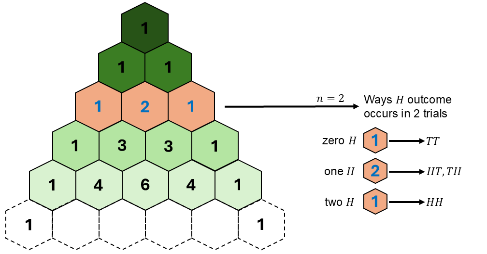
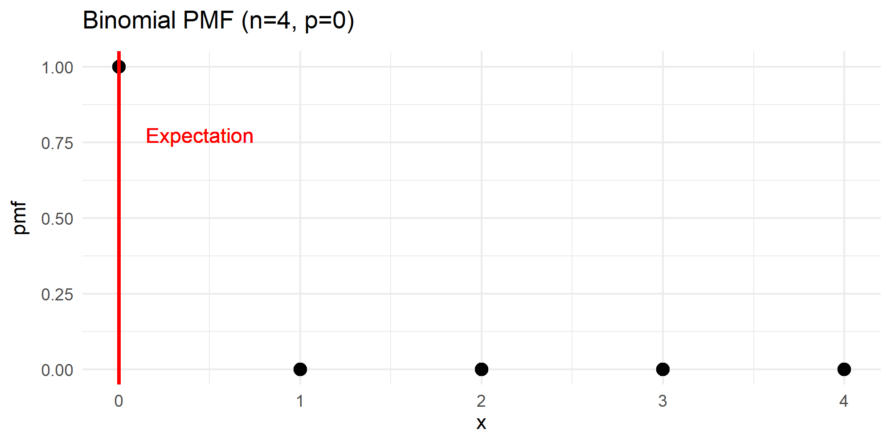
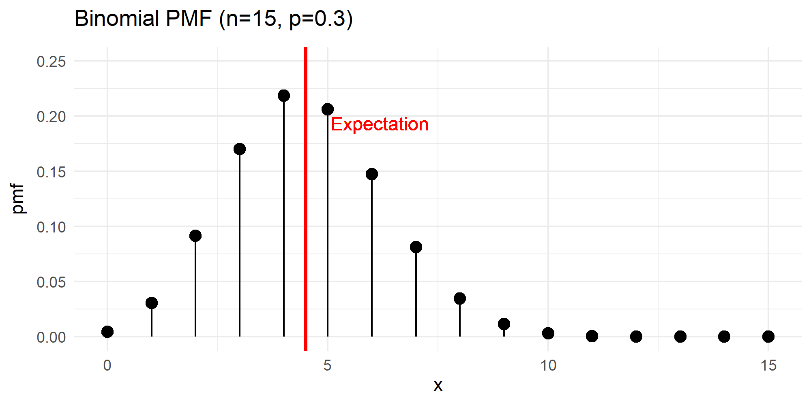

```{r setup, include=FALSE}
knitr::opts_chunk$set(echo = FALSE)
```

```{r echo=FALSE, eval=TRUE,message=FALSE, warning=FALSE}
library(tidyverse)
library(openintro)
library(gghighlight)
library(latex2exp)
data(COL)
seed <- 42
```

## Objectives

:::: {.column width=15%}
::::

:::: {.column width=70%}
- **Know how to connect the binomial distribution to the normal distribution**
- **Develop and understanding of the normal distribution**
- **Activity: The Galton Board and the Normal Distribution**
::::

:::: {.column width=15%}
::::

*These slides are derived from @diez2012openintro.*

## Previously... (1/3)

**Pascal's triangle helps us count**

```{r pascals-triangle-2trial-comb, echo=FALSE, fig.cap="", out.width="60%", fig.align="center"}

```

## Previously... (2/3)

**The Binomial Distribution**

The Binomial distribution is a probability mass function that computes the probability of the Binomial r.v..

$$P(X=k) = \binom{n}{k} p^k (1-p)^{n-k}, \ k = 0,1,2,3, \cdots, n$$ where $p$ is the "success" probability. The term $\binom{n}{k}$ is the binomial coefficient or the numbers in the Pascal's triangle.

## Previously... (3/3)

| **Axiom** | **Statement** |
|:---|:------|
| $P(S) = 1$ | The sum of the probabilities for all outcomes in the sample space is equal to 1. |
| $P \in [0,1]$ | Probabilities are always positive and always between $0$ and $1$. |
| $P(A \text{ or } B) = P(A) + P(B)$ | If events A and B are disjoint (mutually exclusive), then their probabilities can be added. |

## Warm-Up Binomial Probability Problem (1/4)

A nurse is responsible for assessing and monitoring hospitalized patients' vital signs during their shift. Based on hospital data, 90% of patients show stable vital signs with no signs of deterioration after routine monitoring and nursing intervention.

During a shift, the nurse monitors 4 patients and records their vital signs. Assume that each patient’s stability is independent of the others.

:::: {.column width=49%}
**Information Given:**

* $n = 4 \longrightarrow$ Number of patients
* $p = 0.90 \longrightarrow$ Known probability of patients showing stable vital signs
::::

:::: {.column width=49%}
What is the expected number or patients show stable vital signs?
$$
\begin{aligned}
n \times p & = 4 \times (0.90) \\
           & = 3.60
\end{aligned}
$$

We expected to have $\approx 3$ or $\approx 4$ patients to show stable vital signs.
::::

## Warm-Up Binomial Probability Problem (2/4)

:::: {.column width=50%}
```{r eval=TRUE, echo=FALSE, message=FALSE, warning=FALSE, fig.align='center',fig.width=5,fig.height=3,out.width='100%'}
# set parameters, outcomes, and probabilities
n <- 4 # number of trials
p <- 0.90 # set "success" probability
x_outcomes <- seq(0,n,1) # set outcome from 0 to n
binom_pmf <- dbinom(x_outcomes,n,p) # function `dbinom()` is the Binomial PMF 
df <- tibble(x=x_outcomes, pmf=binom_pmf) # convert to tibble

# plot the Bernoulli distribution and store it into a R variable
p1 <- ggplot(df,aes(x=x,y=pmf)) + 
  geom_point(size=3,color="blue") + # size here is defined for all points
  geom_segment(aes(x=x,xend=x, # draws a line between two defined points
                   y=rep(0,length(x)),yend=pmf), 
                   color="blue") + 
  gghighlight(x==3,unhighlighted_colour = "black") + 
  ggtitle(paste("Binomial PMF (n=",n,", p=",round(p,3),")",sep="")) + # sets the title of the plot
  scale_x_discrete(limits=x_outcomes) + 
  theme_minimal() # set theme of entire plot

# display plot
p1
```
::::

:::: {.column width=49%}
What is the probability that **exactly 3 patients** maintain stable vital signs?
$$
\begin{aligned}
P(X = 3) & = P(X=3) \\ 
            & = \binom{4}{3} (0.95)^3 (1-0.95)^{4-3} \\
            & = 4 (0.95)^3 (0.05)^{1} \\
P(X = 3) & \approx 0.2916 \\
\end{aligned}
$$

**Using R:**

```{r echo=TRUE, eval=TRUE}
n <- 4
p <- 0.90
k <- 3
dbinom(3,n,p)
```

There is a 29.16\% probability that **3 patients** show stable vital signs.
::::

## Warm-Up Binomial Probability Problem (3/4)

:::: {.column width=50%}
```{r eval=TRUE, echo=FALSE, message=FALSE, warning=FALSE, fig.align='center',fig.width=5,fig.height=3,out.width='100%'}
# set parameters, outcomes, and probabilities
n <- 4 # number of trials
p <- 0.90 # set "success" probability
x_outcomes <- seq(0,n,1) # set outcome from 0 to n
binom_pmf <- dbinom(x_outcomes,n,p) # function `dbinom()` is the Binomial PMF 
df <- tibble(x=x_outcomes, pmf=binom_pmf) # convert to tibble

# plot the Bernoulli distribution and store it into a R variable
p1 <- ggplot(df,aes(x=x,y=pmf)) + 
  geom_point(size=3,color="blue") + # size here is defined for all points
  geom_segment(aes(x=x,xend=x, # draws a line between two defined points
                   y=rep(0,length(x)),yend=pmf), 
                   color="blue") + 
  gghighlight(x<=3,unhighlighted_colour = "black") + 
  ggtitle(paste("Binomial PMF (n=",n,", p=",round(p,3),")",sep="")) + # sets the title of the plot
  scale_x_discrete(limits=x_outcomes) + 
  theme_minimal() # set theme of entire plot

# display plot
p1
```
::::

:::: {.column width=49%}
What is the probability that **at most 3 patients** remain stable?
$$
\begin{aligned}
P(X \le 3) & = P(X=0) + P(X=1) + P(X=2) + P(X=3) \\ 
            & = \sum_{k=0}^3 \binom{4}{k} (0.95)^k (1-0.95)^{4-k} \\
P(X \le 3) & \approx 0.3439 \\
\end{aligned}
$$

**Using R:**

```{r echo=TRUE, eval=TRUE}
n <- 4
p <- 0.90
k <- 3
pbinom(3,n,p)
```

There is a 34.39\% probability that **3 patients or less** show stable vital signs.
::::

## Warm-Up Binomial Probability Problem (4/4)

:::: {.column width=50%}
```{r eval=TRUE, echo=FALSE, message=FALSE, warning=FALSE, fig.align='center',fig.width=5,fig.height=3,out.width='100%'}
# set parameters, outcomes, and probabilities
n <- 4 # number of trials
p <- 0.90 # set "success" probability
x_outcomes <- seq(0,n,1) # set outcome from 0 to n
binom_pmf <- dbinom(x_outcomes,n,p) # function `dbinom()` is the Binomial PMF 
df <- tibble(x=x_outcomes, pmf=binom_pmf) # convert to tibble

# plot the Bernoulli distribution and store it into a R variable
p1 <- ggplot(df,aes(x=x,y=pmf)) + 
  geom_point(size=3,color="blue") + # size here is defined for all points
  geom_segment(aes(x=x,xend=x, # draws a line between two defined points
                   y=rep(0,length(x)),yend=pmf), 
                   color="blue") + 
  gghighlight(x>=3,unhighlighted_colour = "black") + 
  ggtitle(paste("Binomial PMF (n=",n,", p=",round(p,3),")",sep="")) + # sets the title of the plot
  scale_x_discrete(limits=x_outcomes) + 
  theme_minimal() # set theme of entire plot

# display plot
p1
```
::::

:::: {.column width=49%}
What is the probability that **at least 3 patients** remain stable?
$$
\begin{aligned}
P(X \ge 3) & = 1 - P(X \le 2) \\ 
           & = 1 - P(X=0) + P(X=1) + P(X=2) \\
            & = 1 - \sum_{k=0}^2 \binom{4}{k} (0.95)^k (1-0.95)^{4-k} \\
P(X \ge 3) & \approx 0.9477 \\
\end{aligned}
$$

**Using R:**

```{r echo=TRUE, eval=TRUE}
n <- 4
p <- 0.90
k <- 2
1-pbinom(2,n,p)
```

There is a 94.77\% probability that **3 patients or more** show stable vital signs.
::::

## Binomial Shape (1/2)

The Binomial distribution shape is defined by its parameters $n$ and $p$. Here, $n=4$ while $p$ is changing.

```{r binomial-4p-changes, echo=FALSE, fig.cap="", out.width="80%", fig.align="center"}

```

::: {style="color: red;"}
$\star$ **Key Idea:** If $n$ is fixed while $p$ is changing, the expectation changes as $p$ changes.
:::

## Binomial Shape (2/2)

The famous normal curve shows up if $n$ is large enough and the expectation is $n \times p \ge 5$ and $n \times (1-p) \ge 5$. Here, $n=15$ while $p$ is changing.

```{r binomial-15p-changes, echo=FALSE, fig.cap="", out.width="80%", fig.align="center"}

```

::: {style="color: red;"}
$\star$ **Key Idea:** If $n$ is large enough, the shape becomes more refined into the normal curve (or the normal distribution).
:::

## Normal Approximation to the Binomial

```{r eval=TRUE, echo=FALSE, message=FALSE, warning=FALSE, fig.align='center',fig.width=7,fig.height=3,out.width='80%'}
# binomial random samples using the binomial pmf
p <- 0.50
n <- 20
N <- 10000
x_binom <- seq(0,n)
binom_samples <- rbinom(N,n,p)

# normal pdf
mu <- n*p
sigma <- sqrt(n*p*(1-p))
x_norm <- seq(0,n,0.10)
norm_pdf <- dnorm(x_norm,mu,sigma)

# convert pmf and pdf into tibble
df_binom <- tibble(x=binom_samples) %>% 
  group_by(x) %>% 
  summarise(x_prop=n()/N)
df_norm <- tibble(x=x_norm, norm_pdf=norm_pdf)

# plot the Bernoulli distribution and store it into a R variable
p1 <- ggplot(df_binom,aes(x=x,y=x_prop)) + 
  geom_col(aes(fill="Binomial Samples")) + 
  geom_line(data=df_norm,aes(x=x,y=norm_pdf, color="Normal PDF"), linewidth=1) + 
  ylab("density") + 
  scale_color_manual(values=c("Normal PDF"="#009159")) +
  scale_fill_manual(values=c("Binomial Samples"="darkgray")) + 
  ggtitle("Binomial Samples Approximated by a Normal Distribution") + # sets the title of the plot
  theme_minimal() + # set theme of entire plot
  theme(legend.title=element_blank())

# display plot
p1
```

::: {style="color: red;"}
$\star$ **Key Idea:** The Binomial distribution is approximately the normal distribution given large enough samples because of the Law of Large Numbers.
:::

::: {style="color: blue;"}
$\dagger$ Based on the plot, what do you think is the number of trials $n$ and what is the "success" probability $p$ for the Binomial samples? What is the expectation (or the mean)?
:::

## The Normal R.V.

A **normal r.v.** is a type of continuous r.v. whose probability distribution follows the *normal distribution*, also known as the *Gaussian distribution*. The normal distribution is characterized by two parameters, $\mu$ as the mean and $\sigma^2$ as the variance: $$X \sim \text{N}(\mu,\sigma^2)$$

**Sample Space:**

* $x \in (-\infty,\infty)$ because the normal r.v. can take any value from the entire real number line and it is a continuous random variable.

**Parameters**

* $\mu$ is the mean (center) or the mode of the distribution.
* $\sigma^2$ measures the spread of the distribution.

## The Normal R.V.: PDF

The normal r.v. $X \sim \text{N}(\mu,\sigma^2)$ has infinite possible outcomes (or infinite sized sample space) where $\mu$ is the mean and $\sigma^2$ is the variance ($\sigma$ is the standard deviation) with PDF given the continuous curve below.

```{r eval=TRUE, echo=FALSE, message=FALSE, warning=FALSE, fig.align='center',fig.width=7,fig.height=3,out.width='80%'}
# normal pdf
mu <- 0
sigma <- 1
x_norm <- seq(-4,4,0.10)
norm_pdf <- dnorm(x_norm,mu,sigma)

# convert pdf into tibble
df_norm <- tibble(x=x_norm, norm_pdf=norm_pdf)

# plot the Bernoulli distribution and store it into a R variable
p1 <- ggplot(df_norm,aes(x=x,y=norm_pdf)) + 
  geom_line(color="#009159",linewidth=1) + 
  ylab("density") + 
  ggtitle("Normal Distribution") + # sets the title of the plot
  scale_x_discrete(limits=c(-3,-2,-1,0,1,2,3),label=c(TeX("$\\mu-3\\sigma$"),TeX("$\\mu-2\\sigma$"),TeX("$\\mu-1\\sigma$"),TeX("$\\mu$"),TeX("$\\mu+1\\sigma$"),TeX("$\\mu+2\\sigma$"),TeX("$\\mu+3\\sigma$"))) + 
  theme_minimal() + # set theme of entire plot
  theme(legend.title=element_blank())

# display plot
p1
```

::: {style="color: red;"}
$\star$ **Key Idea:** The normal r.v. often approximates the distribution of many types of data, especially when there are large numbers of independent factors contributing to the outcome.
:::

## The Normal R.V.: Area Under the Curve

```{r eval=TRUE, echo=FALSE, message=FALSE, warning=FALSE, fig.align='center',fig.width=7,fig.height=3,out.width='80%'}
# normal pdf
mu <- 0
sigma <- 1
x_norm <- seq(-4,4,0.10)
norm_pdf <- dnorm(x_norm,mu,sigma)

# convert pdf into tibble
df_norm <- tibble(x=x_norm, norm_pdf=norm_pdf)

# plot the Bernoulli distribution and store it into a R variable
p1 <- ggplot(df_norm,aes(x=x,y=norm_pdf)) + 
  geom_line(color="#009159",linewidth=1) + 
  geom_ribbon(data=subset(df_norm,x>=-4 & x<=4),aes(x=x,ymax=dnorm(x,mu,sigma)),ymin=0,alpha=0.3,fill="#009159") +
  ylab("density") + 
  ggtitle("Normal Distribution") + # sets the title of the plot
  scale_x_discrete(limits=c(0),label=TeX("$\\mu$")) + 
  theme_minimal() + # set theme of entire plot
  theme(legend.title=element_blank())

# display plot
p1
```

::: {style="color: red;"}
$\star$ **Key Idea:** Because of the axiom that the sum of the probabilities for all outcomes in the sample space is equal to 1, the total area under the Normal PDF is always 1.
:::

## Normal Probabilities

:::: {.column width=50%}
**Normal Distribution**

```{r eval=TRUE, echo=FALSE, message=FALSE, warning=FALSE, fig.align='center',fig.width=5,fig.height=3,out.width='100%'}
# set parameters, outcomes, and probabilities
mu <- 20*0.50
sd <- sqrt(20*0.50*(1-0.50))
x_outcomes <- seq(0,20,0.10) # set outcome from 0 to 20 (technically infinite)
norm_pdf <- dnorm(x_outcomes,mu,sd) # function `dnorm()` is the Normal PDF 
df <- tibble(x=x_outcomes, pdf=norm_pdf) # convert to tibble

# plot the Bernoulli distribution and store it into a R variable
p1 <- ggplot(df,aes(x=x,y=pdf)) + 
  geom_line(size=1,color="#009159") + # size here is defined for all points
  geom_ribbon(data=subset(df,x>=0 & x<=13),aes(x=x,ymax=dnorm(x,mu,sd)),ymin=0,alpha=0.3,fill="#009159") +
  ggtitle(TeX(paste("Normal Distribution ","$\\mu$","=",mu," ","$s$","=",round(sd,2)))) + # sets the title of the plot
  theme_minimal() # set theme of entire plot

# display plot
p1
```
::::

:::: {.column width=49%}
**Example:**

What is $P(X \le 13)$ for $X \sim \text{N}(10,2.24)$? 
\[
\begin{aligned}
P(X \le 13) & \approx 0.9098
\end{aligned}
\]

**Using R:**

```{r echo=TRUE, eval=TRUE}
mu <- 10
sd <- 2.24
x <- 13
pnorm(x,mu,sd)
```
::::

::: {style="color: red;"}
$\star$ Note that the `pnorm()` function computes the probability $P(X \le x)$, meaning it computes the area under $f(x)$ from $X=0$ to $X=x$ using the Normal PDF. The `dnorm()` function computes the density, not probability because $P(X = x)=0$ at any $x$.
:::

## Normal Expected Value

:::: {.column width=50%}
**Normal Distribution with Expected Value**

```{r eval=TRUE, echo=FALSE, message=FALSE, warning=FALSE, fig.align='center',fig.width=5,fig.height=3,out.width='100%'}
# set parameters, outcomes, and probabilities
mu <- 20*0.50
sd <- sqrt(20*0.50*(1-0.50))
x_outcomes <- seq(0,20,0.10) # set outcome from 0 to 20 (technically infinite)
norm_pdf <- dnorm(x_outcomes,mu,sd) # function `dnorm()` is the Normal PDF 
df <- tibble(x=x_outcomes, pdf=norm_pdf) # convert to tibble

# plot the Bernoulli distribution and store it into a R variable
p1 <- ggplot(df,aes(x=x,y=pdf)) + 
  geom_line(size=1,color="#009159") + # size here is defined for all points
  geom_vline(xintercept = mu, color="red", linewidth=1) + 
  ggtitle(TeX(paste("Normal Distribution ","$\\mu$","=",mu," ","$s$","=",round(sd,2)))) + # sets the title of the plot
  theme_minimal() # set theme of entire plot

# display plot
p1
```
::::

:::: {.column width=49%}
**Normal R.V.**

Let $\mu=10$ and $s=2.24$ be the mean and standard deviation respectively.

\[
\begin{aligned}
\text{R.V. } & \longrightarrow X \sim \text{N}\left(10,2.24^2\right) \\
\text{PDF } & \longrightarrow f(x) \\
\text{for } & x \in (-\infty,\infty) \\
\text{expected value} & \longrightarrow \text{E}(X) = 10
\end{aligned}
\]

In general, the expected value of the normal r.v. is given by $$\text{E}(X) = \mu,$$ which is the center of the normal distribution.
::::

## Normal Approximation to the Binomial (Revisited)

:::: {.column width=50%}
**When Can we use it?**

The binomial distribution $X \sim \text{Binom}(n,p)$ can be approximated by a normal distribution when:

* $np$ (expected "success") and $np(1-p)$ (expected "fail") are sufficiently large
::::

:::: {.column width=49%}
**Approximation Formula**

* If $X \sim \text{Binom}(n,p)$, then for large $n$, $$X \approx \text{N}(\mu,\sigma^2)$$ where $\mu = np$ and $\sigma^2 = np(1-p)$.
::::

::: {style="color: red;"}
$\star$ The normal approximation simplifies binomial probability calculations for large $n$.
:::

## Why Use Normal Approximation for Binomial?

* **Computational convenience:** Calculating binomial probabilities for large $n$ can be computationally intense because you have to evaluate a large number of terms. The normal approximation simplifies this by allowing you to use the normal distribution.
* **Simplifies calculations:** When $n$ is large, the binomial distribution can become cumbersome to work with directly. The normal approximation provides a simpler alternative that still gives reasonably accurate results.

## The Standard Normal Distribution

The standard normal distribution is when $\mu=0$ and $s=1$ or $X \sim \text{N}(0,1)$.

```{r eval=TRUE, echo=FALSE, message=FALSE, warning=FALSE, fig.align='center',fig.width=7,fig.height=3,out.width='80%'}
# normal pdf
mu <- 0
sigma <- 1
x_norm <- seq(-4,4,0.10)
norm_pdf <- dnorm(x_norm,mu,sigma)

# convert pdf into tibble
df_norm <- tibble(x=x_norm, norm_pdf=norm_pdf)

# plot the Bernoulli distribution and store it into a R variable
p1 <- ggplot(df_norm,aes(x=x,y=norm_pdf)) + 
  geom_line(color="#009159",linewidth=1) + 
  ylab("density") + 
  ggtitle("Standard Normal Distribution") + # sets the title of the plot
  scale_x_discrete(limits=c(-4,-3,-2,-1,0,1,2,3,4)) + 
  theme_minimal() + # set theme of entire plot
  theme(legend.title=element_blank())

# display plot
p1
```

::: {style="color: red;"}
$\star$ **Key Idea:** The standard normal distribution is that it is a normal distribution with a mean of 0 and a standard deviation of 1. It serves as a reference distribution, allowing any normally distributed variable to be standardized. *We will discuss more of this soon.*
:::

## Activity: The Galton Board and the Normal Distribution

1. Watch this video: https://youtu.be/UCmPmkHqHXk?si=LT1apiUwe0meA8PS.
2. Get together with another student.
3. Discuss the video by answering the following question.
    - How does the structure of Pascal's triangle relate to the binomial distribution?
    - Why does the shape of the bead distribution on a Galton board become approximately normal as the number of rows increases?
4. Write your discussion answers on a sheet of paper, then make sure to submit them physically.

## References

::: {#refs}
:::
