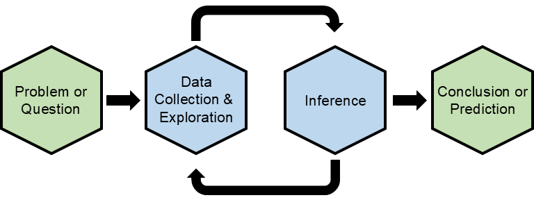

```{r setup, include=FALSE}
knitr::opts_chunk$set(echo = TRUE)
```

```{r statistical-thinking-1, echo=FALSE, fig.align='left', out.width = '70%'}

```

Statistical thinking is a way of understanding the world through data, serving as the foundational principle of statistics.

# Syllabus

## About the Class

### Instructor Information

> * Instructor: Dr. Alex John Quijano
> * Office: Buckley Center 279
> * Email: quijano@up.edu

### Lectures and Discussions

This course meets on Mondays, Wednesdays, and Fridays. Wednesdays and Fridays will focus on discussing topics. Homework and assessments will be scheduled for alternating Mondays. The typical class routine will include pre-reading assignments before each class, followed by a short lecture or demonstration, worksheet activities, group presentations, and discussions.

> The course schedule and location is:
>
> * **Section D:** MWF 9:15 AM - 10:10 AM, Franz Hall 125

### Textbook

This course uses the following textbook - which is free to access - for reading and practice.

```{r echo=FALSE}
refs <- bibtex::read.bib("references.bib")
```

>  * `r capture.output(print(refs["diez2012openintro"]))`

*Amendment 3: The textbook was emphasized.*

### Credit Hours and Prerequisites

* Credit hours: 3
* Prerequisites: None

*Amendment 4: The subsection "Credit hours and Prerequisites" was added with the number of course credits and prerequisites.*

<br>

## Communication Tools

### Class Website

The syllabus, tentative topics schedule, and other information are posted on the course website.

> You can access the course website at [mth-161d-sp25](https://upmathematics.github.io/mth-161d-sp25/){target="_blank"}.

Note that this website can also be viewed in Teams.

### Microsoft Teams

We will be using Teams as the main real-time communication tool for general announcements, question-answering discussions, and direct messages. I added you to the Teams page already, so you just need to log in using your UP credentials. If not, then send a request when you log in. Let me know if you need any assistance.

I recommend that you install the Teams software on your own machine for easy and stable access, instead of accessing Teams on the browser.

> The Teams for this course is [MTH-161D-sp25](https://teams.microsoft.com/l/team/19%3AzLuVe5GlJJ3Y5Ob-I0vypRDPEQLigxvlqaGHR7GAXv41%40thread.tacv2/conversations?groupId=a47c5106-9aa6-4569-b98f-17f70304580a&tenantId=ea8f3949-231c-40b6-a33f-56873af96f87){target="_blank"}. 

Note that this course website and textbook can be accessed in Teams.

### Email

My UP email is quijano@up.edu. 

> If you prefer communicating through email, note that I have set up an email filter for this course, and you must put the “MTH 161” keyword in your subject line. 

It is easy for me to get notice of your email if you put the keyword in the subject line. Concise and specific messages are helpful, so I know how I can best help you.

<br>

## Assignment Tools

### Moodle

We will be using the course [Moodle](https://learning.up.edu){target="_blank"} page for submitting assignments and giving feedback.

> The Moodle for this course is [MTH-161D - sp25 - Elementary Statistics](https://learning.up.edu/course/view.php?id=40831){target="_blank"}. You are already listed in Moodle for this course using your UP account.

### Posit Cloud

We will be using the R programming language as a statistical tool for some assignments. These tools are free and open-source. We will use the [Posit Cloud](https://login.posit.cloud/login?redirect=%2F){target="_blank"} service, an online computing environment that supports computations in R and Python.

*Amendment 1: The sentence "We will be using a computational tool (R) for some assignments." was change to "We will be using the R programming language as a statistical tool for some assignments.*

*Amendment 2: The sentence "We will use the Posit Cloud service, an online computing environment." was modified to "We will use the Posit Cloud service, an online computing environment that supports computations in R and Python."*

> Create a free account at [Posit Cloud Sign-Up](https://login.posit.cloud/register?redirect=%2F){target="_blank"} using your UP email. Note that you must use your UP email for me to add you into the course’s workspace in Posit Cloud. You will receive an email inviting you into the workspace at the first week of the semester.

> R instructions and materials will be provided ad hoc.

Note that the Posit Cloud computing service is free for you but it is metered by computation hours for the instructor. Please only use the service for course related computations.

If you are interested in using your own machine, you can install R environments yourself. First, you need to install [R](https://cran.r-project.org/){target="_blank"}. Next, install [R Studio](https://posit.co/download/rstudio-desktop/){target="_blank"}.

<br>

## Learning Goals

### Description

This course introduces you to the discipline of statistics as a science focused on understanding and analyzing data. Throughout the semester, you will learn how to effectively harness data to navigate uncertainty --exploring how to collect, analyze, and interpret data to draw meaningful conclusions about real-world phenomena. Emphasizing commitment to ethical reasoning and critical thinking, the course will prepare you to apply statistical methods to address complex problems in various academic and professional fields.

### Core Course Statement

The University of Portland offers a liberal arts UP Core Curriculum with a vision of students acquiring knowledge, skills, and values that will prepare you to respond to the needs of the world and its human family, while having a foundation of multiple lenses to address enduring questions of human concern. The UP Core achieves this vision by cultivating six habits of heart and mind in all UP graduates regardless of major.

As a priority for this UP Core class, our focus is the following habits:

  * Use scientific thinking to understand how the world works.
  * Employ mathematical and/or statistical models and techniques to make sense of data and solve problems.
  * Use empirical analysis to address human, social or ecological problems.

As part of developing that habit this course will prioritize students learning to the learning outcomes listed below. Toward this end, one specific UP Core learning outcome for this class is that students who complete this course will be able to apply basic statistical techniques to collect, organize, analyze, and interpret data, and to effectively communicate the results of such analyses in addressing real-world problems.

### Learning Outcomes

Upon completion of the course, you will be able to:

  * Understand and articulate the fundamental structure of data, how it is collected, and evaluate its limitations and their impact on the validity of inferential results.
  * Present data effectively using graphical methods and compute key descriptive statistics.
  * Apply statistical techniques to analyze individual variables or explore relationships between multiple variables, while correctly interpreting the results in context.
  * Use linear regression models appropriately and provide contextual interpretations of the findings.
  * Explain the core principles of random variables and probability theory.
  * Critically assess claims and make informed decisions based on data-driven evidence.
  * Develop and execute basic R code for data analysis, statistical modeling, and data visualization.

### Learning Objectives

The following learning objectives are designed to build on one another, with some overlap. The goal is to help you achieve proficiency in these areas.

| **Topic** | **Core Learning Objectives** | **Additional Learning Objectives** |
|:---|:---------|:---------|
| **Orientation** | **O1:** Identify key components of the course syllabus, including grading policies, major assignments, and due dates. | **O2:** Explain the expectations and learning outcomes of the course. |
| **Statistical Thinking** | **ST1:** Define the purpose and importance of statistical thinking in data analysis. <br>**ST2:** Differentiate between descriptive and inferential statistics through real-world examples. <br>**ST3:** Explain the role of variability and uncertainty in data. |  |
| **R and R Studio** | **RRS1:** Navigate the RStudio interface and explain its key components. <br>**RRS2:** Run basic R commands and interpret their outputs | **RRS3:** Install and load R packages relevant to data analysis. |
| **R Markdown** | **RM1:** Create and compile a basic R Markdown document. <br>**RM2:** Use R Markdown to integrate narrative text, code, and visualizations. | **RM3:** Format R Markdown documents for clear and professional presentation. |
| **Data Basics & <br>Descriptive Statistics** | **DB1:** Identify and categorize different types of data (numerical vs. categorical). <br>**DB2:** Compute measures of central tendency (mean, median, mode) and spread (range, variance, standard deviation). <br>**DB3:** Interpret descriptive statistics to summarize data. | **DB4:** Visualize data using basic plots (histograms, box plots) using R. |
| **Basic Data Structures** | **BDS1:** Use R to create and manipulate basic data structures. | **BDS2:** Differentiate between vectors, matrices, data frames, and lists in R. |
| **Sampling Principles and Strategies** | **SPS1:** Describe key sampling techniques (simple random, stratified, cluster). <br>**SPS2:** Differentiate between a population and a sample, identify examples of each, and explain how samples are used to make inferences about populations. | **SPS3:** Evaluate the strengths and limitations of various sampling strategies. |
| **Observational and Experimental Studies** | **OES1:** Distinguish between observational studies and experiments. <br>**OES2:** Evaluate the validity of conclusions drawn from observational and experimental data. | **OES3:** Identify key components of a well-designed experiment (randomization, control, replication). |
| **Examining Numerical Data** | **END1:** Identify patterns, outliers, and trends in numerical data. | **END2:** Use R to create visualizations such as scatter plots and line graphs. |
| **Summarizing Numerical Data** | **SND1:** Compute and interpret key summary statistics for numerical datasets. | **SND2:** Use R to compute key summary statistics for numerical variables. |
| **Considering Categorical Data** | **CCD1:** Summarize categorical data using frequency tables and bar charts. <br>**CCD2:** Compute and interpret proportions and relative frequencies. | **CCD3:** Use R to analyze and visualize categorical data. <br>**CCD3:** Use R to compute key summary statistics for categorical variables. |
| **Inference** | **I1:** Identify and distinguish between two types of inference: parameter estimation and hypothesis testing. <br>**I2:** Differentiate between a population and a sample based on their definitions and characteristics. |  |
| **Basic Probability** | **BP1:** Define and calculate probabilities using basic rules. | **BP2:** Interpret probability in context. |
| **Binomial Distribution** | **BD1:** Define the properties of a binomial random variable. | **BD2:** Use R to compute probabilities and cumulative probabilities for binomial distributions. |
| **Normal Distribution** | **ND1:** Explain the properties of the normal distribution. <br>**ND2:** Apply the empirical rule to estimate probabilities for normally distributed data. | **ND3:** Use R to calculate probabilities and percentiles for normal distributions. |
| **Conditional Probability** | **CP1:** Compute conditional probabilities using contingency tables and Bayes' theorem. <br>**CP2:** Apply conditional probability to practical scenarios. |  |
| **Point Estimates and Sampling Variability** | **PESV1:** Explain the concepts of point estimates and variation.  <br>**PESV2:** Explain and interpret the p-value. |  |
| **Confidence Intervals** | **CI1:** Explain and interpret confidence intervals. |  |
| **Decision Errors** | **DE1:** Define and explain the null and alternative hypothesis in context. <br>**DE2:** Define Type I and Type II errors and their implications in hypothesis testing. | **DE3:** Evaluate the impact of sample size and significance level on decision errors. |
| **Inference for One Proportion** | **IOP1:** Conduct a hypothesis test for one proportion. <br>**IOP2:** Evaluate assumptions and interpret the p-value and confidence interval for one proportion. |  |
| **Hypothesis Testing for Proportions** |  | **HTP:** Perform a hypothesis test for proportions to a dataset using R. |
| **Inference for Difference of Two Proportions** | **IDTP1:** Perform hypothesis tests comparing two proportions. <br>**IDTP2:** Evaluate assumptions and interpret the p-value and confidence interval for two proportions. |  |
| **Testing for Goodness of Fit** |  | **TGF1:** Use chi-square tests to assess goodness of fit. <br>**TGF2:** Evaluate assumptions and interpret the chi-square statistics in the context of goodness-of-fit tests. |
| **Testing Independence in Two-Way Tables** | **TITWT1:** Conduct chi-square tests for independence. <br>**TITWT2:** Evaluate assumptions and interpret the p-value for two-way tables. |  |
| **Inference for One Mean** | **IOM1:** Perform one-sample t-tests. <br>**IOM2:** Evaluate assumptions and interpret the p-value and confidence interval for one mean. |  |
| **Hypothesis Testing for Means** |  | **HTM1:** Perform a hypothesis test for means to a dataset using R. |
| **Inference for Difference of Two Means** | **IDTM1:** Perform two-sample t-tests. <br>**IDTM2:** Evaluate assumptions and interpret the p-value and confidence interval for comparing two means. |  |
| **Inference for Paired Means** |  | **IPM1:** Conduct paired t-tests to compare means. <br>**IPM2:** Evaluate assumptions and interpret confidence interval and p-value for paired data. |
| **Introduction to Linear Regression, <br>Correlation, & <br>Residuals** | **LR1:** Interpret the slope and intercept of a regression line in context. <br>**LR2:** Explain the meaning of the correlation coefficient. <br>**LR3:** Understand the concept of residuals and interpret regression errors. |  |
| **Inference for Linear Regression** | **ILR1:** Estimate the slope and intercept, <br>**ILR2:** Construct confidence intervals for regression coefficients. <br>**ILR3:** Evaluate assumptions and interpret p-value and confidence interval for regression coefficients. |  |
| **Hypothesis Testing for Linear Regression** |  | **HTLR1:** Perform hypothesis test for linear regression to a dataset using R. |
| **Least-Squares Regression** | **LSR1:** Explain the method of least-squares regression. | **LSR2:** Fit a least-squares regression line to a dataset using R. |
| **Points of Leverage** |  | **PL1:** Able to distinguish regression outliers and evaluate their impacts. |
| **Comparing Many Means, <br>Multiple Linear Regression, & <br>Logistic Regression** |  | **CMM1:** Use ANalysis Of Variance (ANOVA) to compare more than two group means. <br>**CMM2:** Interpret F-statistics and p-values in the context of ANOVA. <br>**MLR1:** Fit and interpret multiple linear regression models to a dataset using R. <br>**LR1:** Explain the concept and application of logistic regression in binary classification problems. |

<br>

## Topics Schedule

| **Week** | **Day** | **Topic** |
|:--:|:--:|:---------------|
| **1** | M 1/13 | Orientation |
|  | W 1/15 | Statistical Thinking |
|  | F 1/17 | R and R Studio |
| **2** | M 1/20 | _MLK Day (no classes, offices closed)_ |
|  | W 1/22 | RMarkdown |
|  | F 1/24 | Data Basics & <br>Descriptive Statistics |
| **3** | M 1/27 | Basic Data Structures & <br>**Homework 1** |
|  | W 1/29 | Sampling Principles and Strategies |
|  | F 1/31 | Observational and Experimental Studies |
| **4** | M 2/3 | **Assessments 1** |
|  | W 2/5 | Examining Numerical Data |
|  | F 2/7 | Summarizing Numerical Data |
| **5** | M 2/10 | Considering Categorical Data |
|  | W 2/12 | Inference |
|  | F 2/14 | _Cancelled_ |
| **6** | M 2/17 | **Assessments 2** & <br>**Homework 2** |
|  | W 2/19 | Basic Probability |
|  | F 2/21 | Binomial Distribution |
| **7** | M 2/24 | Normal Distribution & <br>**Homework 3** |
|  | W 2/26 | Conditional Probability |
|  | F 2/28 | _Cancelled_  |
| **8** | M 3/3 | _Spring Vacation_ |
|  | W 3/5 | _Spring Vacation_ |
|  | F 3/7 | _Spring Vacation_ |
| **9** | M 3/10 | **Assessments 3** |
|  | W 3/12 | Point Estimates and Sampling Variability |
|  | F 3/14 | Confidence Intervals |
| **10** | M 3/17 | Inference for One Proportion & <br>**Homework 4** |
|  | W 3/19 | Hypothesis Testing for Proportions |
|  | F 3/21 | Decision Errors & <br>Inference for Difference of Two Proportions |
| **11** | M 3/24 | **Assessments 4** |
|  | W 3/26 | Testing for Goodness of Fit & <br> Testing Independence in Two-Way Tables |
|  | F 3/28 | Inference for One Mean |
| **12** | M 3/31 | Hypothesis Testing for Means & <br>**Homework 5** |
|  | W 4/2 | Inference for Difference of Two Means |
|  | F 4/4 | Inference for Paired Means |
| **13** | M 4/7 | **Assessments 5** |
|  | W 4/9 | Introduction to Linear Regression, <br>Correlation, & <br>Residuals |
|  | F 4/11 | Inference for Linear Regression |
| **14** | M 4/14 | Hypothesis Testing for Linear Regression & <br>**Homework 6** |
|  | W 4/16 | Least-Squares Regression |
|  | F 4/18 | _Easter vacation_ |
| **15** | M 4/21 | _Easter Vacation_ |
|  | W 4/23 | Points of Leverage |
|  | F 4/25 | Comparing Many Means, <br>Multiple Linear Regression, & <br>Logistic Regression |
| **16** | Th 5/1 | **Final Assessments <br>(10:30 AM to 12:30 PM)** |

<br>

## Academic Support

### Help Hours

> Dr. Alex John Quijano
> 
> * Walk-in Monday to Friday at 4:00 PM - 5:00 PM, Buckley Center 279
> * [One-to-One, Buckley Center 279 or in Teams](https://calendly.com/alexjohnquijano/helphours){target="_blank"} <br>*Click on the link to sign-up for a 15-minute session.*

My walk-in help hours start week 2. Note that you can bring a fellow student with you when you sign-up for a session. Just click the "Add Guests" link when you sign-up, and add in your fellow student's UP email. If you need more than 15 minutes, you can book at least two consecutive sessions.

### The Learning Commons

You can get academic assistance through Learning Commons tutoring services and workshops. The Co-Pilot peer tutoring program provides you with opportunities to work with other students to get help in writing, math, group projects, and other courses. Schedule an appointment to meet with a Co-Pilot (tutor) by visiting the [Learning Commons](www.up.edu/learningcommons){target="_blank"} website. You can also meet with a Co-Pilot during drop-in hours. Check the Learning Commons website or drop by the Learning Commons in BC 163 to learn more about their services. Find a tutor at the Learning Commons to get support on your academic journey.

### Math Resource Center

Appointment-based tutoring accepts appointments starting week 1 and sessions start week 2. Visit the [Math Resource Center](https://www.up.edu/learningcommons/tutoring-services/math-resource-center/index.html){target="_blank"} website to sign-up for an appointment. Drop-in tutoring is Monday to Thursday, 3:00 PM - 7:00 PM in BC 163 and starts week 2. Check the Math Resource Center website or drop by the center for more information.

### Help Hours Guidelines

It is strongly recommended that you attend the walk-in help hours or set up a one-to-one meeting with the me if you feel like you are falling behind during our in-person class activities, or if you just need to clarify concepts discussed in class. In order to be more productive during a one-to-one meeting (or the walk-in help hours), these are three recommendations before you come in:

  * List all gaps in knowledge you have (missed concepts) or list all concepts that were unclear to you during class. We will address them one by one.
  * Prepare questions you want answered and be ready to show relevant materials.
  * Regarding assignments, prepare to show (a) what are the steps you have tried and (b) what are the errors you encountered and the strategies you have tried.

Note that these are recommendations so that you can get the most out of the help hours allocated for you. If you just want to come in and chat about something else, feel free to do so. If the dedicated time for one-to-one meeting does not work for you, send me a message to set up an appointment.

### Collaboration Policy

I expect you to participate in the class through lectures, class activities, discussions, homework, and other engagements. I also expect you to make use of opportunities to get help outside of class (help hours, Teams, email, tutoring) if you need help. Concise and specific messages are the most helpful so I know how I can best help you.

> You are encouraged to participate in discussions with your peers regarding assignments. However, each student must take responsibility and ownership of their work and submit their work individually, except for group projects.

> You may not collaborate during assessments but you are permitted to access the textbook, Posit Cloud, Teams, and the internet.

<br>

## Assessment

### Assessment Disclosure Statement

Student work products for this course may be used by the University for educational quality assurance purposes. For reasons of confidentiality, such examples will not include student names.

### Standards-Based Grading

Learning statistics demands focus, rigorous examination of the concepts you have encountered, and a process of ongoing refinement and improvement. You will be assessed on your proficiency in statistical thinking, scientific reasoning, and inference. You will have opportunities to demonstrate your proficiency, revise your work, and reflect on your growth in analyzing data, interpreting results, and making data-driven conclusions.

This course uses a standards-based grading system, which emphasizes mastery of specific learning objectives. This approach is more precise and motivating than traditional grading methods and fosters a more equitable learning environment. Key features of standards-based grading include:

  * A clear focus on mastering defined learning objectives
  * The use of diverse assessment methods to evaluate understanding
  * Regular, detailed feedback to guide your progress
  * Support in setting meaningful goals and tracking your growth

This system prioritizes learning and personal development, enabling you to excel and reach your highest potential.

### General Marking Guide

Each assignment will be graded according to the general marking guide detailed below. You will be given feedback on your assignment and learning process to improve your performance. Note that each assignment has its own rubric guided by these general guidelines and the assignment’s learning objectives.

Given the following marks, your work:

| **Mark** | **Rubric Description** |
|:-----|:---------------|
| **Outstanding <br>(O)** | Demonstrates a full understanding of the material, clearly and concisely explains concepts, applies them correctly and efficiently to solve problems, and may extend the concepts to new situations. |
| **Excellent <br>(E)** | Demonstrates an approximate understanding of the material, may have made minor errors but is able to correct them and explain the reasoning, solves problems correctly, and may need more time or practice to improve efficiency. |
| **Acceptable <br>(A)** | Demonstrates some understanding of the material but makes errors, can solve some problems, may need help with more difficult ones, and may need to work on improving problem-solving skills and reasoning. |
| **Needs Improvement <br>(NI)** | Shows potential but needs more work, may have made several errors, is unable to solve problems, and needs to focus on understanding the material and developing problem-solving skills. |
| **Needs Major Improvement <br>(NMI)** | Shows little understanding of the material, may have made many significant errors, is unable to solve problems, and needs to focus on building a foundational understanding of the material. |
| **Missing <br>(M)** | Shows incomplete (either entirely or partially) or incomprehensible work. |

Note that these are categorical marks (not numerical scores).

### Final Course Grades

| **Assignment** | **Rank** | **Mark** | **A** | **B** | **C** | **D** |
|:----------|:-----:|:-----:|:-----:|:-----:|:-----:|:-----:|
| **Core Learning Objectives** | 1 | O | 90% | - | - | - |
|  |  | E | - | 80% | - | - |
|  |  | A | - | - | 70% | - |
|  |  | NI | - | - | - | 60% |
| **Additional Learning Objectives** | 2 | O | 80% | - | - | - |
|  |  | E | - | 70% | - | - |
|  |  | A | - | - | 60% | - |
|  |  | NI | - | - | - | 50% |
| **Homeworks** | 3 | O | 100% | - | - | - |
|  |  | E | - | 90% | - | - |
|  |  | A | - | - | 80% | - |
|  |  | NI | - | - | - | 70% |
| **Worksheets** | 4 | Completed | 90% | 80% | 70% | 60% |

The above table shows the percent of given assignments. These percentages are minimum requirements for each letter grade. The rank determines the importance of each assignment where 1 means the highest rank and 4 means lowest rank.

> If you need more assistance on understanding your overall standing in this course, I encourage you to communicate with me directly.

<br>

## Assignments

### Submission Guidelines

Your work must be labeled correctly and clearly written. Homework and worksheets can be electronically hand-written or typed but must be uploaded to Moodle as a single pdf or html file. If you choose to handwrite your answers on paper, scan your document using a scanner app to ensure the text is clear. I recommend using the 'Adobe Scan' app, which is available for both Android and iOS."

> You need to submit your homework and worksheet assignments online through Moodle.

> The assessments will be given during class. Depending on the learning objective, assessments must be submitted physically or online through Moodle. They will then be returned to students with feedback through Moodle.

### Worksheets

There will be worksheets every Wednesday and Friday. The purpose of the worksheets is for in-class group work and activities.

> You must submit your worksheet individually by end-of-class or end-of-day. Your name must exist in your worksheet and the names of your collaborators.

Worksheets are marked mostly on completion, and partially on correctness. It will be marked either pass or fail, there will no detailed feedback on worksheets, and no opportunities for revisions and make-up.

### Homeworks

Homework is assigned every other Monday. The purpose of the homework is to provide practice with problems, and it will include tasks that involve R. Some homework assignments include specific learning objectives that will be assessed separately from the main content.

> You must submit your homework individually by the end of the day on Friday of the week it is assigned.

Homeworks are marked using the general grading guide and will be returned with detailed feedback.

### Homework Revisions

You can revise your homework for an up-grade, meaning - for example - a grade of "NI" can be up-graded to "A".

Here are the qualifications and requirements for homework revisions:

  * A homework mark of "NMI", "NI", "A", or "E".
  * The revised homework must be completed, meaning all parts should have your full written solutions.
  * Homework marked with "M" is disqualified for revisions, but you can still use them as practice.
  
Here are the rules for homework revisions:

  * Homework revisions are accepted within one week of the homework being returned to you, otherwise the grade is set.
  * You can revise your homework multiple times as long as it is not marked as "M".

### Assessments

Assessments are given every other Monday after a short summary review. The purpose of the assessments is to evaluate your understanding of the learning objectives. Each assessment is specifically designed according to the learning objective being assessed.

> Assessments are administered during class after a short summary review, and you have the entire class period to work on it.

Assessments are marked using the general marking guide and will be returned with detailed feedback. Your work will be marked according to these three components:

| **Component** | **Description** |
|:-----|:---------------|
| **Methodology** | The method should be sound and well-founded. It should be based on a solid understanding of the underlying principles. The method should be applied correctly and consistently. |
| **Reasoning** | The solution method should be explained in a clear and logical way. The steps of the method should be justified and explained. The reasonableness of the solution should be justified. |
| **Writing** | The solution process should be written in a clear and concise way. The steps of the method should be easy to follow. The graphs/diagrams/equations should be clear and helpful. The mathematical notation should be used clearly and correctly. |

Here are the rules for the assessments:

  * Assessments are strictly due at the end of class.
  * Collaboration among peers is not allowed.
  * You may use all resources, which includes the textbook, Posit Cloud, Teams, and the internet.

### Assessment Retakes

Your assessments can be revised and you can retake it. Retakes allows you to have your assessments up-graded, meaning - for example - a grade of "NI" can be up-graded to "A". The purpose of retaking an assessment is to reflect on the feedback from your previous attempt and learn how to correct any mistakes.

Here are the qualifications for assessment retakes:

  * An assessment mark of "NMI", NI", "A", or "E".
  * The revised assessment must be completed, meaning all parts should have your full written solutions. Incomplete work is disqualified for retakes.
  
Here are the rules for assessment retakes:

  * Retakes must be done within one week of the assessment being returned to you, otherwise the grade is set.
  * If you need to retake an assessment more than one week of the exam being returned to you, let me know for a discussion.
  * Completed revisions of the previous assessment must be provided before you can retake it.
  * If you need to retake an assessment more than once, you are required to sign-up a one-to-one help hour session with me for a discussion before you can sign up for another retake.
  * You can retake assessments multiple times as long as it is not marked as "M".

> Here is how you can sign-up for the assessment retakes:
>
> * [Retake Assessment (Lower-Division)](https://calendly.com/alexjohnquijano/retake-or-make-up-exam-quiz-upper-division){target="_Blank"} <br>Click on the link to sign-up for a 55-minute proctored session. Retakes must be scheduled 24 hours in advance.

### Make-up Assessments

You can make-up assessments due to extenuating circumstances. Please let me know if you can’t make it to an assessment day. If you missed an assessment day without prior discussion, please let me know as soon as possible to discuss the next steps.

Here are the rules of make-up exams:

  * A missed assessment day means that you will automatically receive a mark of *M* for that particular assessment.
  * You need to have a prior discussion with me before you can schedule a make-up assessment.
  * Make-up assessment must be done within one week of the original assessment day.
  * If you need to make-up an assessment more than one week of the original exam day, let me know for a discussion.

> Here is how you can sign-up for the assessment make-ups:
>
> * [Make-Up Assessment (Lower-Division)](https://calendly.com/alexjohnquijano/retake-or-make-up-exam-quiz-upper-division){target="_Blank"} <br>Click on the link to sign-up for a 55-minute session. Make-ups must be scheduled 24 hours in advance.

### Final Assessments

There is no official final exam for this course; instead, the final exam serves as a last opportunity to retake and improve past assessments, and assessments on remaining learning objectives.

> Final assessments consists of the remaining learning objectives, and opportunities to retake past core assessments.

Here are additional rules for retakes during the final assessments:

  * You can only retake at most three core assessments.
  * You need to let me know what core assessments you are taking during the last week of classes.
  * The assessment to be retaken must meet retake qualifications.
  * Make-up assessments during the final will not be granted.

> The final assessments are on:
>
>   * **Section D:** May 1, Th 10:30 AM - 12:30 PM, Franz Hall 125

<br>

## Expectations

### Deadline Extension Policy

If you need more time to submit an assignment, you may request an extension by following these steps:

  * Communicate with me at least 12 hours before the deadline.
  * Specify the exact day you plan to submit your work or the number of extra days you need.
  * Please ensure that you adhere to the established timeline for submitting assignments, as it is important to maintain fairness and avoid over-reliance on extensions.

Submitting a few hours late is usually not a major issue, as long as I receive your work before I begin marking and providing feedback. An extension is not required in such cases. Extensions for in-class assignments --such as worksheets, mini-assignments, or activities-- will only be granted if I decide to extend the deadline for the entire class.

*Amendment 5: The sentence "If you need more time to submit a homework assignment, you may request an extension by following these steps:" was changed to "If you need more time to submit an assignment, you may request an extension by following these steps:".*

*Amendment 6: The sentence "Extensions for worksheets will only be granted if I decide to extend the deadline for the entire class." was changed to "Extensions for in-class assignments --such as worksheets, mini-assignments, or activities-- will only be granted if I decide to extend the deadline for the entire class."*

### Late Assignments

You are expected to turn in all completed assignments on time. Circumstances that may disallow you to turn in your work on time - such as a medical reason - are understandable. Please let me know if you have missed the deadline way beyond its original posted date without prior communication regarding extensions. Because every assignment is an important aspect of your learning in this class, we will discuss when you will turn in the assignment as well as decide upon an acceptable consequence for your turning it in late. I am committed to successfully helping you learn from this course.

*Amendment 7: The "Late Assignments" subsection was moved.*

*Amendment 8: The sentence "Please let me know if you are unable to submit your work and have missed the deadline way beyond its original posted date." was modified to "Please let me know if you have missed the deadline way beyond its original posted date without prior communication regarding extensions."*

### Withdrawal Procedures

It is the student's responsibility to drop the course if he or she is no longer planning on attending the course or filling the other course requirements. In order to drop, the student must use and Add/Drop form available at the Registration Office. If a student does not properly withdraw from a course, he or she may receive an **F** for the course. A properly withdrawn student will receive a **W**. The last day to withdraw is **Monday, April 14th**.

### Appointment Cancellation Policy

You can cancel your appointments, but it is strongly recommended that you cancel 24 hours before your scheduled time so that other students can schedule when a spot opens. You can reschedule for a different day and time if you need to.

Please try to show-up to any of your appointments. If you have extenuating circumstances, please let me know as soon as possible to discuss next steps.

*Amendment 9: The title was changed from "Appointment Cancelation Policies" to "Appointment Cancellation Policy".*

### Attendance and Participation

Attendance is not tracked. However, participation is highly recommended. You are expected to actively participate in this class. Participation includes coming to class on time, being prepared, being willing to ask questions and share ideas, setting up study groups outside of class, attending tutoring sessions, posting helpful resources online, and contributing to the Teams discussion channels. Group and individual presentations of ideas is a suggested component of participation.

### Absences

Generally, students are expected to attend all class sessions according to the instructor’s direction. Students who feel unwell should NOT attend class in person. These students should inform their instructor as soon as possible. 

Should the instructor need to miss class, the course may be temporarily conducted remotely. Should the instructor be unable to teach for an extended period of time, the respective department or unit will find a substitute to continue the course.

### Incompletes

An incomplete "I" will only be considered when the quality of a student's work is satisfactory (C- or better), but for some essential reason the course has not been completed by the student. An "I" is reserved for emergency situations only. To request an incomplete, the student must submit a typed, signed and dated letter stating the reason(s) why an incomplete is appropriate. The letter should also contain the conditions for the completion of work. Acceptance of the request shall be at the discretion of the instructor, Department Chair, and/or Dean of the College of Arts \& Sciences.

### Accessibility Statement

The University of Portland strives to make its courses and services fully accessible to all students. Students are encouraged to discuss with their instructors what might be most helpful in enabling them to meet the learning goals of the course. Students who experience a disability are also encouraged to use the services of the Office for Accessible Education Services (AES), located in the Shepard Academic Resource Center (503-943-8985). **If you have an AES Accommodation Plan**, you should meet with your instructor to discuss how to implement your plan in this class. Requests for alternate location for exams and/or extended exam time should, where possible, be made two weeks in advance of an exam, and must be made at least one week in advance of an exam. Also, if applicable, you should meet with your instructor to discuss emergency medical information or how best to ensure your safe evacuation from the building in case of fire or other emergency. All information that students provide regarding disability or accommodation is confidential. All students are responsible for completing the required coursework and are held to the same evaluation standards specified in the course syllabus.

### Code of Academic Integrity

The University of Portland is a diverse academic community of learners and scholars who are dedicated to freely sharing ideas and engaging in respectful discussion of those ideas to discover truth. Such pursuits require each person, whether student or faculty, to present truthfully our own ideas and give credit to others for the ideas that they generate. Thus, cheating on exams, copying another student’s assignment, including homework, or using the work of others without proper citation are some examples of violating academic integrity. 

Especially for written and oral assignments, students have an ethical responsibility to properly cite the authors of any books, articles, or other sources that they use. Students should expect to submit assignments to Turnitin, a database that ensures assignments are original work of the student submitting. Each discipline has guidelines for how to give appropriate credit, and instructors will communicate the specific guidelines for their discipline. The Clark Library also maintains a webpage that provides citation guidelines at  [https://libguides.up.edu/cite](libguides.up.edu/cite){target="_blank"}.

The misuse of AI to shortcut course learning outcomes will be treated as a violation of academic integrity comparable to plagiarism or cheating. Faculty are responsible for including a written “Course AI Policy” in their syllabi that clearly states what they consider appropriate and inappropriate uses of AI in the context of their courses. Students are responsible for using AI in ways that do not detract from the established learning outcomes of the course. All members of the scholarly community are responsible for demonstrating sound judgment in discerning when and how to utilize AI in their work, upholding standards of citation, originality, and integrity.

Please see the University Bulletin for further information: [up.smartcatalogiq.com/en/2023-2024/bulletin/](http://up.smartcatalogiq.com/en/2022-2023/bulletin/University-Academic-Regulations/I-Code-of-Academic-Integrity/Guidelines-for-Implementation-of-the-Universitys-Code-of-Academic-Integrity){target="_blank"}.

### Course AI Policy

The use of generative AI — such as Copilot, Gemini, or ChatGPT — is encouraged and allowed in all of its capacity. However, students must use these tools ethically and responsibly. To use generative AI responsibly in this class, students should grasp underlying concepts, acknowledge AI's assistance, protect data privacy, verify information, and uphold academic honor code. AI should be seen as a learning aid, not a replacement for critical thinking.

### Referencing and Citation Guidelines

In your written work for this course, you must cite all sources of information that you use, whether they are direct quotes, paraphrases, or summaries. The style of citation that you use should be consistent throughout your paper. The citation styles for this course are APA or CSE.

  * APA style is used in the social sciences and psychology. It is characterized by parenthetical citations that include the author's last name and the year of publication. For example, "According to Smith (2023), the average height of a man in the United States is 5'10"."
  * CSE style is used in the natural sciences and engineering. It is characterized by numbered citations that are listed at the end of the paper. For example, "[1] Smith, J. (2023). The average height of a man in the United States. Journal of Human Biology, 55(2), 123-132."

If you are unsure which citation style to use, please consult with me. You can also find more information about APA and CSE style in the Clark Library citation guidelines: [libguides.up.edu/cite](https://libguides.up.edu/cite){target="_blank"}

Plagiarism is the act of using someone else's work without giving them credit. It is a serious academic offense that can result in a failing grade or even expulsion from school. By following these guidelines, you can help to avoid plagiarism and ensure that your work is properly cited.

### Mental Health Statement

Anyone may sometimes experience problems with their mental health that interfere with academic experiences and negatively impact daily life. If you or someone you know experiences mental health challenges at UP, please contact the [University of Portland Counseling Center](https://www.up.edu/counceling/){target="_blank"} in the upper level of Orrico Hall (down the hill from Franz Hall and near Mehling Hall) at 503-943-7134 or [hcc@up.edu](mailto:hcc@up.edu){target="_blank"}. Their services are free and confidential. In addition, confidential phone counseling is available at the Pilot Helpline by calling 503-943-7134 and pressing 3. The University of Portland Campus Safety Department (503-943-4444) also has personnel trained to respond sensitively to mental health emergencies at all hours. Remember that getting help is a smart and courageous thing to do – for yourself, for those you care about, and for those who care about you. For more information on health and wellness resources at UP go to [https://linktr.ee/wellnessUP](https://linktr.ee/wellnessUP){target="_blank"}.

### Non-Violence Statement

The University of Portland is committed to fostering a safe and respectful community free from all forms of violence. Violence of any kind, and in particular acts of power-based personal violence, are inconsistent with our mission. Together, all UP community members must take a stand against violence. Learn more about what interpersonal violence looks like, campus and community resources, UP’s prevention strategy, and what we as individuals can do to assist on the [Green Dot website](https://www.up.edu/greendot){target="_blank"}, [www.up.edu/greendot](https://www.up.edu/greendot){target="_blank"}. Further information and reporting options may be found on the [Title IX website](https://www.up.edu/titleix){target="_blank"}, [www.up.edu/titleix](https://www.up.edu/titleix){target="_blank"}.

### Ethics of Information

The University of Portland is a community dedicated to the investigation and discovery of processes for thinking ethically and encouraging the development of ethical reasoning in the formation of the whole person. Using information ethically, as an element in open and honest scholarly endeavors, involves moral reasoning to determine the right way to access, create, distribute, and employ information, including: considerations of intellectual property rights, fair use, information bias, censorship, and privacy. More information can be found in the Clark Library’s guide to the Ethical Use of Information at [Ethical Use of Information](https://libguides.up.edu/ethicaluse){target="_blank"} at [libguides.up.edu/ethicaluse](https://libguides.up.edu/ethicaluse){target="_blank"}.

### Diversity and Inclusion Statement

In the study of natural and mathematical sciences, often perceived as objective disciplines aimed at understanding the world, it is crucial to recognize the historical biases embedded within these fields, stemming from a limited set of privileged populations. Acknowledging the potential existence of overt and covert biases within the course, I emphasize that science is a human endeavor necessitating the incorporation of diverse experiences in the pursuit of knowledge and skill. Valuing every student irrespective of background, origin, race, religion, ethnicity, sexual orientation, disability status, etc., I am committed to fostering an inclusive climate throughout the course. Encouraging open communication about concerns or challenges, I assure confidentiality, except for instances of academic integrity violations or sexual harassment, which are legally mandated to be reported. Within our classroom, diversity and individual differences are celebrated as strengths, and the use of mathematics as an analytical tool to challenge power, privilege, and oppression is supported. It is our collective responsibility to create a welcoming space where ideas can be challenged while maintaining respect for individuals.

<br>

# Materials

> You are required to read the materials, and are strongly encouraged to actively participate in class discussions and complete the assignments efficiently to deepen your understanding and succeed in the course.

## Class Readings and Presentations

The "Read" column in the table below contains page numbers (Pg.) or chapters (ch.) on which it refers to a label in the Books \& Online Resources List. For example "Pg. 1-5 @diez2012openintro" refers to pages 1-5 of the textbook titled *Openintro Statistics*.

| **Topic** | **Read** |
|:---|:---|
| [Orientation](lessons/1.1-mth161-orientation/1.1-mth161-orientation.html) | Syllabus |
| [Statistical Thinking](lessons/1.2-mth161-statistical-thinking/1.2-mth161-statistical-thinking.html) | - |
| [R and R Studio](lessons/1.3-mth161-r-and-r-studio/1.3-mth161-r-and-r-studio.html) | - |
| [RMarkdown](lessons/2.1-mth161-rmarkdown/2.1-mth161-rmarkdown.html) | - |
| [Data Basics & <br>Descriptive Statistics](lessons/2.2-mth161-data-basics-and-descriptive-statistics/2.2-mth161-data-basics-and-descriptive-statistics.html) | Pg. 12-18 @diez2012openintro |
| [Basic Data Structures](lessons/3.1-mth161-basic-data-structures/3.1-mth161-basic-data-structures.html) | - |
| [Sampling Principles and Strategies](lessons/3.2-mth161-sampling-principles-and-strategies/3.2-mth161-sampling-principles-and-strategies.html) | Pg. 22-28 @diez2012openintro |
| [Observational and Experimental Studies](lessons/3.3-mth161-observational-and-experimental-studies/3.3-mth161-observational-and-experimental-studies.html)  | Pg. 32-34 @diez2012openintro |
| [Examining Numerical Data](lessons/4.1-mth161-examining-numerical-data/4.1-mth161-examining-numerical-data.html) | Pg. 41-55 @diez2012openintro |
| [Summarizing Numerical Data](lessons/4.2-mth161-summarizing-numerical-data/4.2-mth161-summarizing-numerical-data.html) | - |
| [Considering Categorical Data](lessons/5.1-mth161-considering-categorical-data/5.1-mth161-considering-categorical-data.html) | Pg. 61-68 @diez2012openintro |
| [Inference](lessons/5.2-mth161-inference/5.2-mth161-inference.html) | - |
| [Basic Probability](lessons/6.1-mth161-basic-probability/6.1-mth161-basic-probability.html) | Pg. 81-91 @diez2012openintro |
| [Binomial Distribution](lessons/6.2-mth161-binomial-distribution/6.2-mth161-binomial-distribution.html) | Pg. 149-155 @diez2012openintro |
| [Normal Distribution](lessons/7.1-mth161-normal-distribution/7.1-mth161-normal-distribution.html) | Pg. 133-141 @diez2012openintro |
| Conditional Probability | Pg. 95-108 @diez2012openintro |
| [Point Estimates and Sampling Variability](lessons/9.1-mth161-point-estimates-and-samping-variability/9.1-mth161-point-estimates-and-samping-variability.html) | Pg. 170-178 @diez2012openintro |
| [Confidence Intervals](lessons/9.2-mth161-confidence-intervals/9.2-mth161-confidence-intervals.html) | Pg. 181-186 @diez2012openintro |
| Inference for One Proportion | Pg. 208-213 @diez2012openintro |
| Hypothesis Testing for Proportions | - |
| Decision Errors | Pg. 189-201 @diez2012openintro |
| Inference for Difference of Two Proportions | Pg. 217-224 @diez2012openintro |
| Testing for Goodness of Fit & <br>Testing Independence in Two-Way Tables | Pg. 229-238 & Pg. 240-244 @diez2012openintro |
| Inference for One Mean | Pg. 251-258 @diez2012openintro |
| Hypothesis Testing for Means | - |
| Inference for Difference of Two Means | Pg. 267-273 @diez2012openintro |
| Inference for Paired Means | Pg. 262-264 @diez2012openintro |
| Introduction to Linear Regression, <br>Correlation, & <br>Residuals | Pg. 305-311 @diez2012openintro |
| Inference for Linear Regression | Pg. 331-334 @diez2012openintro |
| Hypothesis Testing for Linear Regression | - |
| Least-Squares Regression | Pg. 317-324 @diez2012openintro |
| Points of Leverage | Pg. 328-329 @diez2012openintro |
| Comparing Many Means, <br>Multiple Linear Regression, & <br>Logistic Regression | - |

## Books \& Online Resources Lists

::: {#refs}
:::

<br>
